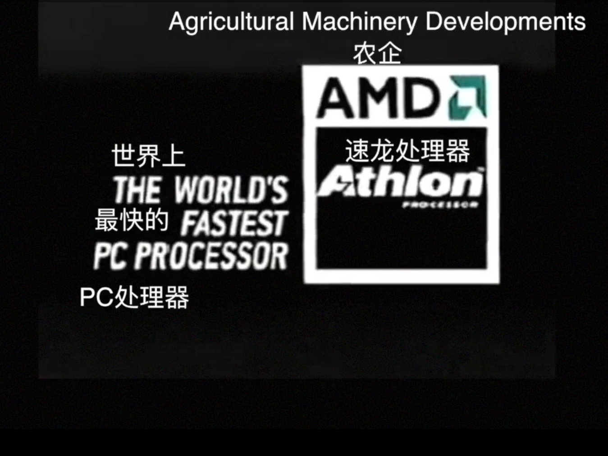
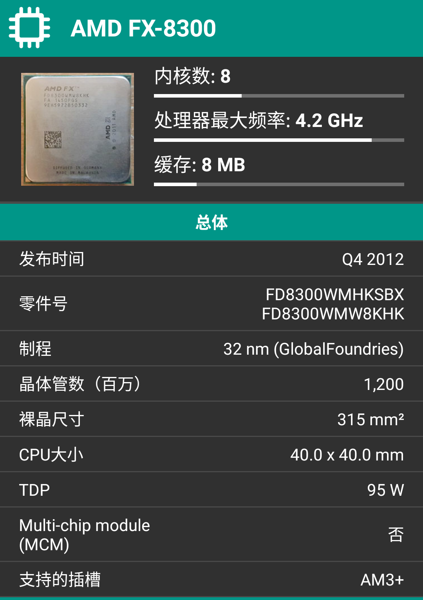
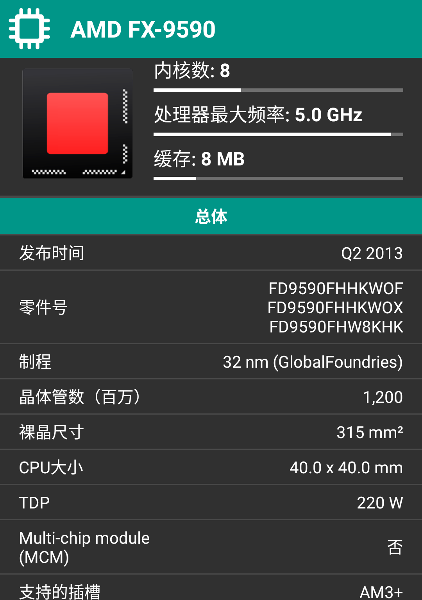
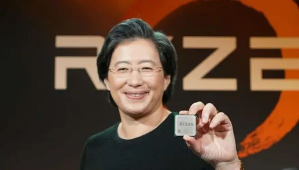
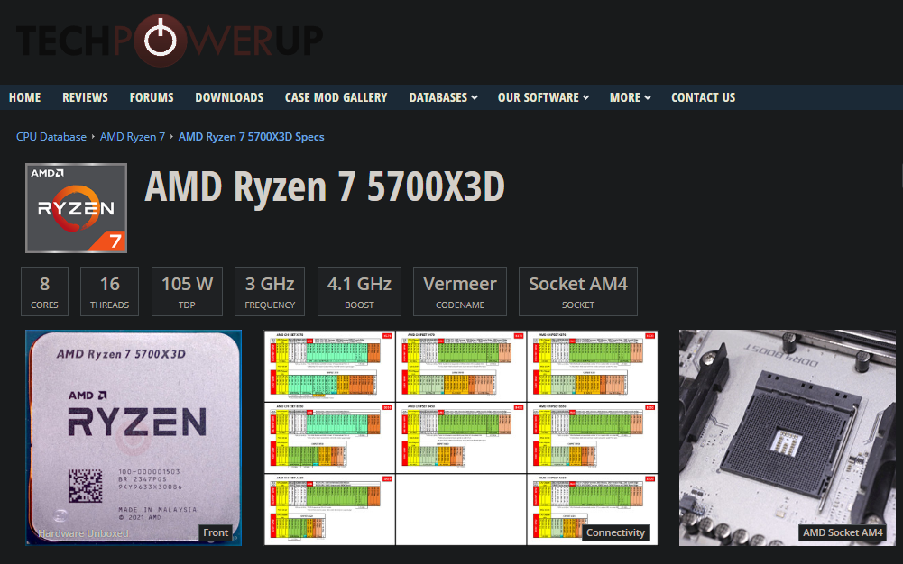
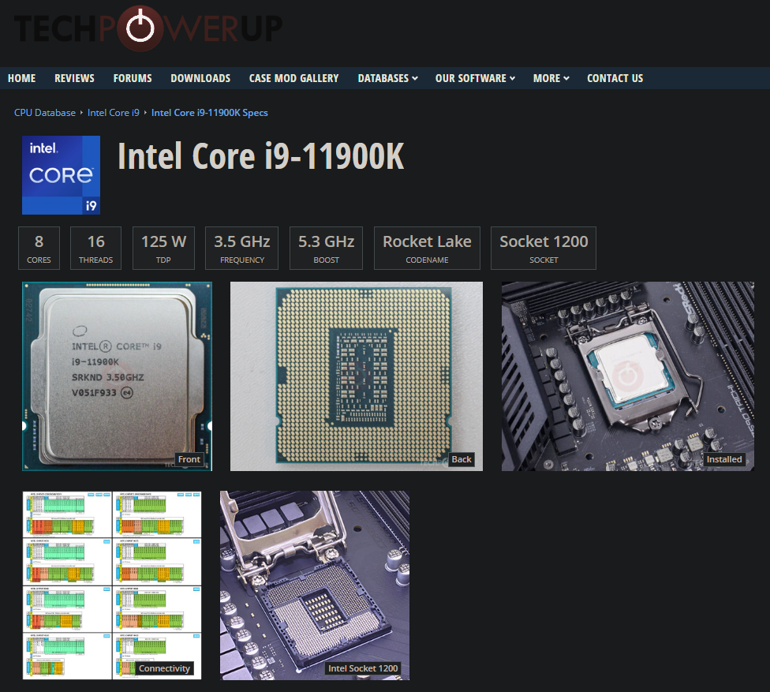

>本文主干部分掘自笔者 2023 年的 QQ 收藏夹，原作者与首发平台已湮没于互联网信息洪流中。今日（2026年）重新翻出，结合近几年 Intel 与 AMD 的最新战况进行了‘续写’与‘考古修正’。时过境迁，风水轮流转。

众所周知，近几年AMD在Zen架构不断耕耘，取得了非常成功的成绩。不能说是吃得非常香吧，也能说是混得风生水起了。作为一家极具冒险精神的公司，AMD在冒险的路上不断吸取教训，勇于创新，取得了巨大的成功。 

时间拨回到2008年，Intel的Nehalem架构以巨大的优势彻底KO了AMD的K10架构。有过之前成功案例的AMD，肯定不会放弃接受失败。在悲愤的情绪下，继续去开发下一代微处理器架构，这注定是一场复仇之战。 

在2011年，AMD蓄势待发，延续了K10架构的悲剧，给自己来了一场轰轰烈烈的大革命。然而所有证据都表明，AMD这次革命是彻底革了自己的命，把自己的饭碗砸得稀巴烂，可谓电子芯片发展史上的一大浩劫。此时公司的最低股价来到了两美元出头，在破产的边缘不断试探。这到底是什么回事呢？原来是当年革命性发布了“Bulldozer”架构，也就是推土机。 

推土机的设计理念不同于传统的x86，居然采用了模块化设计，每个模块里面有两个核心，每一个核心都有一个完整的整数运算单元，但是两个核心共用一个浮点计算单元。我就以打桩机FX-8300为例。它是由八核心四模块设计，浮点计算单元只有4个。按照传统的设计，都是一个核心用一个浮点计算单元，AMD的这种设计有效减少了多余电路，更方便增加更多的核心。这何不是一种新的发展方向和创意呢？反正用AMD的话来说，这就是物理多核心设计，八核四模块吧，可以简单理解为八核心四线程。每一个模块可以说是先天性残疾，两个核心才凑出来一个线程，这就是AMD在赌未来的软件优化方向，只不过AMD一个都没赌对。 

后来为了弥补推土机破烂不堪的单核性能，本着不作死就不会死的想法，用功率去堆主频，主频的疯狂叠加自然导致了功率疯狂增长。后来TDP功耗甚至达到了200瓦，动态频率达到恐怖的5.0的核弹FX-9590。即使是如今13代、14代酷睿见到了他，也要叫一声核弹老祖。 

AMD高管的种种操作，不出意外的话肯定要出意外了。搞完这些操作，AMD回头一看，哦吼，我大楼呢？我的晶圆厂呢？哦豁，全部赌没了。这真是吊瓶里通电线：输麻了呀。

当时的AMD穷得只剩下空气和PPT。就在大家都以为AMD要给Intel送上“独孤求败”的终身成就奖时，AMD掏出了他们最后的底牌。

2014年，那个女人——苏姿丰（Lisa Su）正式接掌AMD。苏妈上台后，看了一眼推土机留下的烂摊子，果断做出了一个违背祖宗的决定：全盘推翻，重开新局！

这一重开，就开出了芯片史上的又一个神话：Zen系列架构。

时间来到2017年，AMD带着第一代锐龙处理器杀回战场。这一次，AMD不赌虚无缥缈的未来了，而是脚踏实地搞起了传统的大核心。

第一代锐龙Ryzen 7 1800X，直接整出了8核心16线程。你以为它又要走FX时代“数核心”的老路？不！这一次，每个核心都有自己独立的、完整的浮点运算单元，再也不是当年的“先天残疾”了。

最让隔壁Intel吐血的是，AMD把积攒了多年的怨气化成了两个字：性价比。

性能上，锐龙的IPC（每时钟周期指令数）相比那个不争气的打桩机，暴涨了惊人的 52%！

价格上，Intel一个4核8线程的i7敢卖三千块，AMD反手就是一个8核16线程卖同样的价格，甚至还附赠一个能发光的散热器。

这一波操作，直接把当时正在安稳挤牙膏的Intel从高高的王座上给一脚踹了下来。Intel只能连夜把原本规划在未来几年的6核、8核产品提前发布（牙膏被挤爆了）。

如果说第一代Zen只是让AMD能和Intel平起平坐，那么随后的 Zen 2 和 Zen 3 架构，则是AMD真正开始教Intel做人的时候。他们拿出了大杀器——Chiplet（小芯片芯粒）技术。

简单来说，AMD不再追求把所有核心塞进一块大晶圆里，而是把它们拆成一个个小的“计算模块（CCD）”和一个“输入输出模块（IOD）”，然后再用高级封装技术像搭积木一样把它们拼在一起。

坊间辣评：隔壁Intel曾嘲笑这是“胶水多核”，结果AMD用实际行动证明——只要胶水取得好，哪怕是高通、苹果也得直呼内行。

精妙之处在于：

省钱：坏了一个小模块不心疼，良品率高到让财务做梦都能笑醒。

堆核狂魔：桌面端轻松塞进16核（Ryzen 9 3950X），服务器端的EPYC（霄龙）更是直接堆到了64核、128核，把Intel的至强（Xeon）锤得找不到北。

到了Zen 3时代末期和Zen 4时代，他们发现，CPU的核心频率卷到一定程度就边际效应递减了，那怎么提升游戏性能呢？

于是，革命性的 3D V-Cache（3D垂直缓存） 技术诞生了。AMD通过3D堆叠工艺，在原本的CPU核心上面，硬生生“粘”了一块巨大的三级缓存。代表作 Ryzen 7 5800X3D 和后来的 7800X3D，凭借着恐怖的超大缓存，在游戏里犹如开了物理外挂，帧率表现直接把Intel那些动辄300瓦、主频飙到5.3GHz的“灰烬版” i9-11900 按在地上摩擦。

从2美元的破产边缘，到如今市值几千亿美元的高科技巨头。咸鱼不仅翻身了，还把翻它的人给一锅炖了！