# 一、Anycast自动寻路的技术门道与原理机制

Anycast技术在网络架构演进里，算得上是个能“四两拨千斤”的巧妙设计。本质上讲，**Anycast是一种网络寻址和路由方法，传入的请求能路由到多个不同的位置**。这和传统的单播（一对一）、组播（一对多）有着根本区别，它实现了“一对最近”的智能路由机制。

## 1.1 Anycast的核心架构与基础原理

Cloudflare的Anycast网络架构设计堪称经典。**所有数据中心都公布相同的IP地址集**，这种设计好处不少。首先，能保证最终用户的访问速度最优，不管在哪儿，都能连接到最近的数据中心；其次，Anycast能帮忙分散DoS流量，遭攻击时每个位置接收的流量只是总量的一小部分，过滤掉无用流量也就更容易。

从技术实现来看，**Anycast技术通过把同一IP地址动态绑定到全球多个服务节点，让终端用户的访问请求能自动路由到最优节点**。这种架构早就超越了传统单播和组播模式，靠BGP协议实现“一对最近”的智能路由。实际运行中，用户发起请求后，流量会自动导到最近、最优的Cloudflare数据中心，而不是固定服务器。

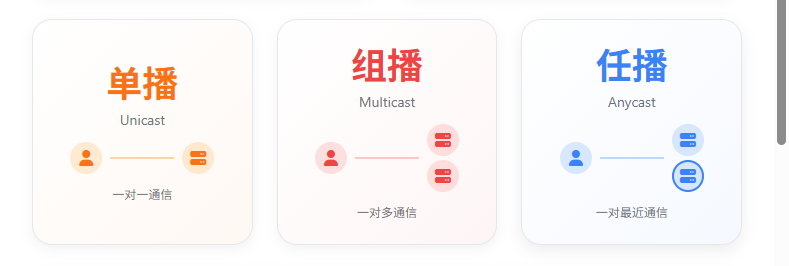

## 1.2 BGP协议在Anycast中的关键作用

**BGP（边界网关协议）是实现Anycast的核心协议**。各个站点通过BGP向互联网宣告相同的IP前缀，比如198.51.100.0/24，上游ISP会根据BGP路径选择规则（像最短AS_PATH）决定下一跳，用户流量就自动导向网络拓扑上“最近”的Anycast节点。

简单说，这就像个分布式“导航系统”。当用户流量发到Anycast IP地址时，网络会基于路由协议和度量，自动把流量路由到最近或最优化的服务器。具体来讲，路由器会用它常规的决策算法——通常是最少的BGP网络跳数，把数据包送到离发送方最近的目的地。

在Cloudflare的实际应用中，**Anycast会把流量吸引到离最终用户最近的Cloudflare数据中心**。要是某个数据中心出故障或负载太高，Cloudflare的网络工程师可以删掉该数据中心的一些Anycast路由，实现流量转移。结果就是：不再在受影响的数据中心广播这些前缀后，用户流量会转到另一个数据中心——这就是Anycast的基本工作原理，用户流量会被引导到广播用户要连接的前缀的数据中心，这由边界网关协议决定。

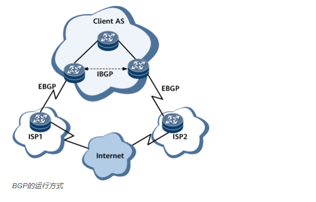

## 1.3 自动寻路的算法机制与优化策略

Anycast的自动寻路不只是简单算距离，而是个综合考虑多种因素的复杂过程。**Cloudflare的网络会监测全球互联网的拥堵情况，基于Anycast动态调整路径**。这种感知网络拓扑的能力，能让系统动态优化路由选择。

正常情况下，Anycast网络路由能跨多个数据中心路由传入的连接请求。当请求进入和Anycast网络关联的单个IP地址时，网络会按某种优先级排序方法分发数据。**通常会选离请求方最近的数据中心，以此优化选择过程，缩短延迟**。

Cloudflare还用到了更高级的优化策略。比如在骨干网里用分段路由流量工程（SR-TE）时，能自动选择数据中心之间针对延迟和性能优化过的路径。有时候，就路由协议成本而言的“最短路径”，未必是延迟最低或性能最好的，这时候就需要更智能的算法来做选择。

## 1.4 Cloudflare全球节点布局与负载均衡

截至2024年7月，**Cloudflare在120多个国家/地区的330个城市设有数据中心**，每个数据中心都运行着Cloudflare的设备和服务。虽然这些数据中心的服务器数量和计算能力不一样，但向各地提供Cloudflare产品和服务的目标始终没变。

Cloudflare的全球Anycast网络有超过320个数据中心位置，能确保在世界任何地方都快速响应DNS查询。这些数据中心战略性地分布在全球，保证业务覆盖所有主要地区，还能帮客户遵守当地法规。这是个可编程的智能网络，流量会尽可能传到最佳数据中心处理。

在负载均衡方面，**Cloudflare的Anycast网络能应对高流量、网络拥堵和DDoS攻击**。某个数据中心出故障或负载过高时，流量会自动路由到其他可用数据中心，这种自动故障转移机制大大提高了服务可靠性。同时，Anycast还能把DDoS攻击流量分散到多个数据中心，避免单个节点被压垮。

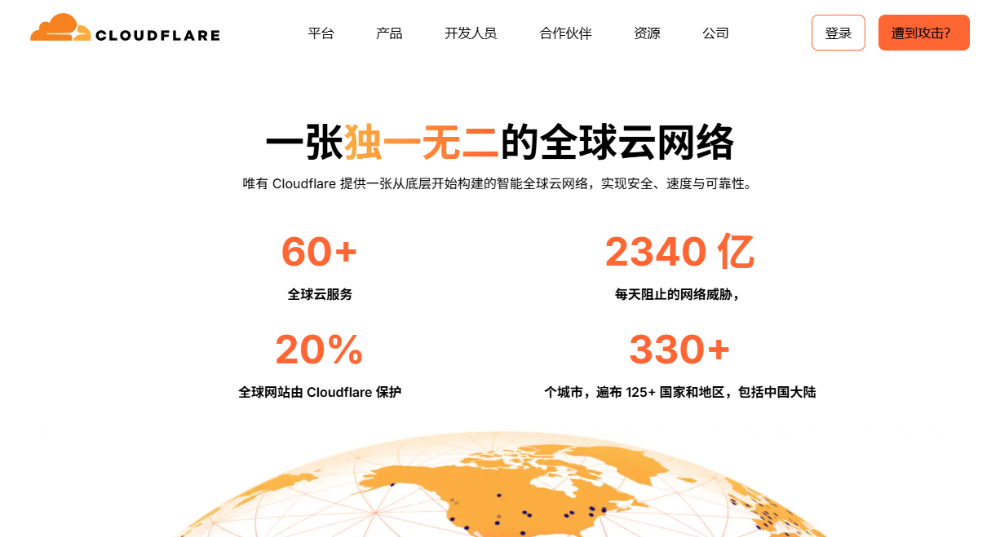

## 1.5 如何查看自己命中了哪个节点？

在使用Cloudflare代理的网站主域名后面加上`/cdn-cgi/trace`，就能查看调试信息，从传回的colo参数能定位到具体节点所在城市。比如[https://www.cloudflare.com/cdn-cgi/trace](https://www.cloudflare.com/cdn-cgi/trace)，能看到我默认命中了洛杉矶节点，其他用Cloudflare代理的网站，大概率命中的节点和官网差不多，但也有例外，比如Cloudflare中国官网，命中的节点名称显示是国内的。

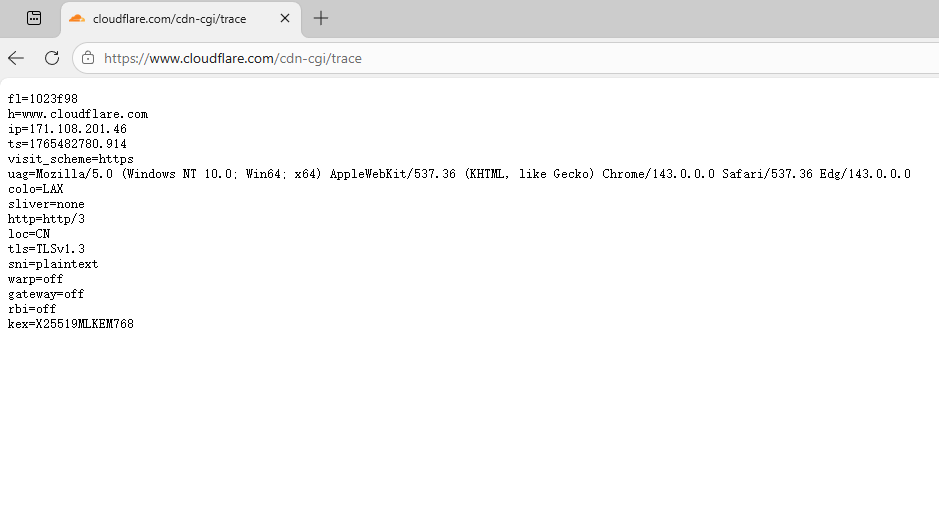

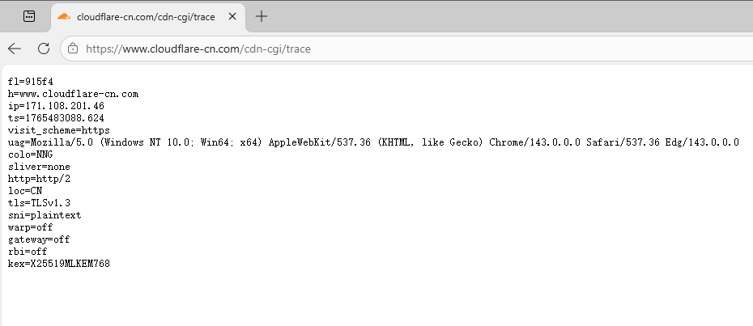

不过有些别有用心的人，要是没走Cloudflare的正常路径，而是手动去优选，命中的节点就会不一样。比如优选后的博客，和默认路径不同，显示的是新加坡节点。

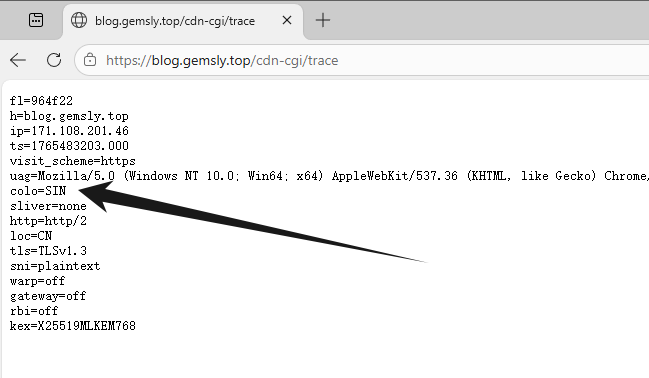

还有Cloudflare的官方测试工具：[https://speed.cloudflare.com/](https://speed.cloudflare.com/)，也能现场查看命中的节点。在国内BGP路由的寻路机制下，我被分到了法兰克福。

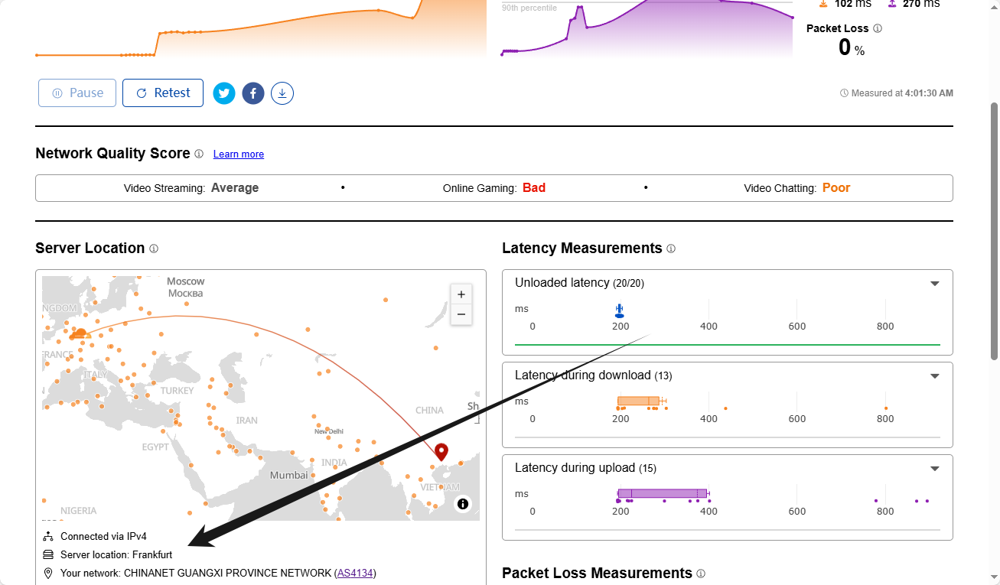

# 二、国内网络访问Cloudflare Anycast困境

## 2.1 三大运营商国际出口布局与路由策略差异

想理解国内用户访问Cloudflare境外Anycast时，频繁连接欧美节点的现象，得先了解三大运营商的国际出口布局和路由策略。**三大运营商在北京、上海、广州都设有国际出入口局（IXE），有独立AS与全球Tier1/IX对接**。

中国电信的国际出口布局最完善，在广州连接APCN2、SJC、FLAG；上海连接NCP、APG；北京连接TPE、陆缆俄蒙。电信有两条主要线路：**163骨干网（ChinaNet）和CN2网络**。其中163网络承担85%的网络流量，CN2网络只承担15%。在路由优先级上，中国电信把大部分CF IPv4路由调整到CT-SJC机房，选择CF-SJC路由的延迟能低到143ms。

中国联通的国际出口布局相对简单，在上海连接TPE、APG；广州连接AAG；北京连接TSL、CMI。联通主要用169网（AS4837）和A网/9929（AS9929），其中A网仅占联通国际流量的不到0.5%。值得注意的是，**中国联通把一半的CF IPv4路由调整到欧洲CF-FRA，绕Orange之后，延迟能低到133ms**，这就解释了为啥联通用户经常被路由到欧洲节点。

中国移动的国际出口布局最集中，主要在广州连接C2C、SJC2；上海连接NCP；北京只有少量陆缆。移动的9808网（AS9808）是2010年后随着4G/家宽大爆发快速扩张的，但因为国际海缆资源不足，经常在北京/广州转接163（AS4134）或169（AS4837）实现出海。不过移动也有自己的优势——**移动最佳选择是走香港CF-HKG路由，延迟能低到29ms**。

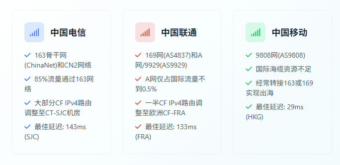

## 2.2 国际出口带宽分配与路由优先级设置

三大运营商在国际出口带宽上差异明显。从总量看，**中国电信的国际带宽最大（7.7T），其次是中国联通，最后是中国移动**。但从人均用户出口带宽来看，顺序就变了：中国联通＞中国电信＞中国移动。

这种带宽分配差异直接影响用户体验。对于经常访问外网的需求，用中国联通的固网是最明智的，但这优势在访问Cloudflare时没充分体现出来，背后原因更复杂。

在路由优先级设置上，各运营商都有自己的策略。比如中国电信设置了复杂的路由优先级：天翼云最高优先级200，阿里云150，其他100。这些策略虽然主要针对国内网络，但也会间接影响国际流量的路由选择。

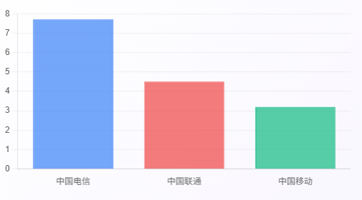

## 2.3 国际互联链路与BGP路由信息传递机制

国际互联链路是影响国内用户访问Cloudflare节点的关键因素之一。**Cloudflare与中国电信在香港建立对等节点，为的是减少跨洲延迟**。理论上这种对等互连机制能让国内用户更直接访问Cloudflare的亚太节点，但实际情况并非如此。

BGP路由信息的传递机制在这儿起了重要作用。BGP作为域间路由协议，用于不同单位、机构负责的网络之间通信。实际运行中，**BGP路由的前提是“不同AS的路由器互相认识”，这过程叫“建立BGP邻居关系”**。两台BGP路由器通过TCP 179端口建立连接，邻居关系建立后，会通过“UPDATE消息”互相交换路由信息。

但在国内网络环境中，这种路由信息传递机制存在问题。根据网络测试数据，国内大晚上Cloudflare经常出异常，中国电信延迟能高达900ms。正常情况下，华东的移动走CMI连接Cloudflare边缘节点，比如宿迁移动到Cloudflare的延迟在40-60ms，但实际使用中，用户经常被路由到更远的欧美节点。

## 2.4 国内网络环境下连接欧美节点的深层原因分析

国内用户访问Cloudflare境外Anycast时，频繁连接欧美节点的主要原因总结如下：

**第一，运营商路由策略的影响**。中国联通把一半的CF IPv4路由调整到欧洲CF-FRA节点，这种主动调整直接导致联通用户常被路由到欧洲。中国电信虽然理论上能连接亚太节点，但复杂的路由优先级设置和过滤策略，让实际效果不太理想。

**第二，国际海缆资源的限制**。中国移动因为国际海缆资源不足，经常需要转接电信或联通的网络出海。这种依赖关系让移动用户访问Cloudflare时缺乏直接路径选择，更容易被路由到欧美节点。

**第三，BGP路由信息传递的偏差**。虽然Cloudflare在香港等地建了对等节点，但这些节点的路由信息可能没法有效传到国内运营商的核心路由器。运营商为控制带宽成本，会屏蔽部分亚太节点的路由宣告，或者设置特定路由优先级，让欧美节点的路由信息更容易被识别和选择。

**第四，二级宽带运营商的影响**。很多国内用户是二级宽带运营商的服务，这些运营商没有独立的国际路由规划，只能依赖三大运营商提供的默认出口。而这些默认出口很多时候通往欧美，用户就算离亚太节点更近，也只能连接欧美服务器。

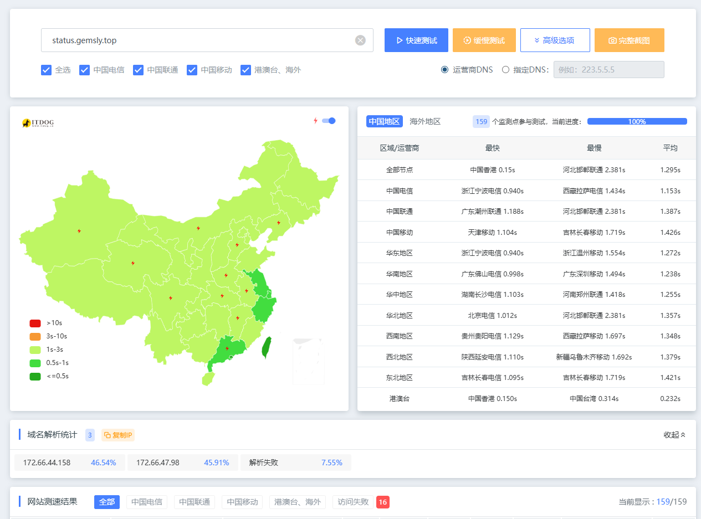

## 2.5 实际测试数据与用户体验差异

从大量实际测试数据能更直观看到国内用户访问Cloudflare节点的体验差异。测试结果显示，**云南昭通市移动用户访问美国Cloudflare节点延迟253ms，重庆移动用户访问泛播Cloudflare节点延迟234ms**。这些数据明显高于理论上该有的延迟水平。

不同运营商的对比测试结果也差异明显。中国电信用户访问Cloudflare的延迟在143ms-900ms之间波动，白天正常时段约143ms，晚高峰或网络拥堵时能高达900ms。中国联通用户调整路由策略后，访问CF-FRA节点的延迟能降到133ms。中国移动用户要是能连接到香港节点，延迟能低到29ms，但这种情况不多见。

更让人困惑的是，有些用户发现就算用相同的运营商和地理位置，不同时间访问Cloudflare的延迟也会差很多。

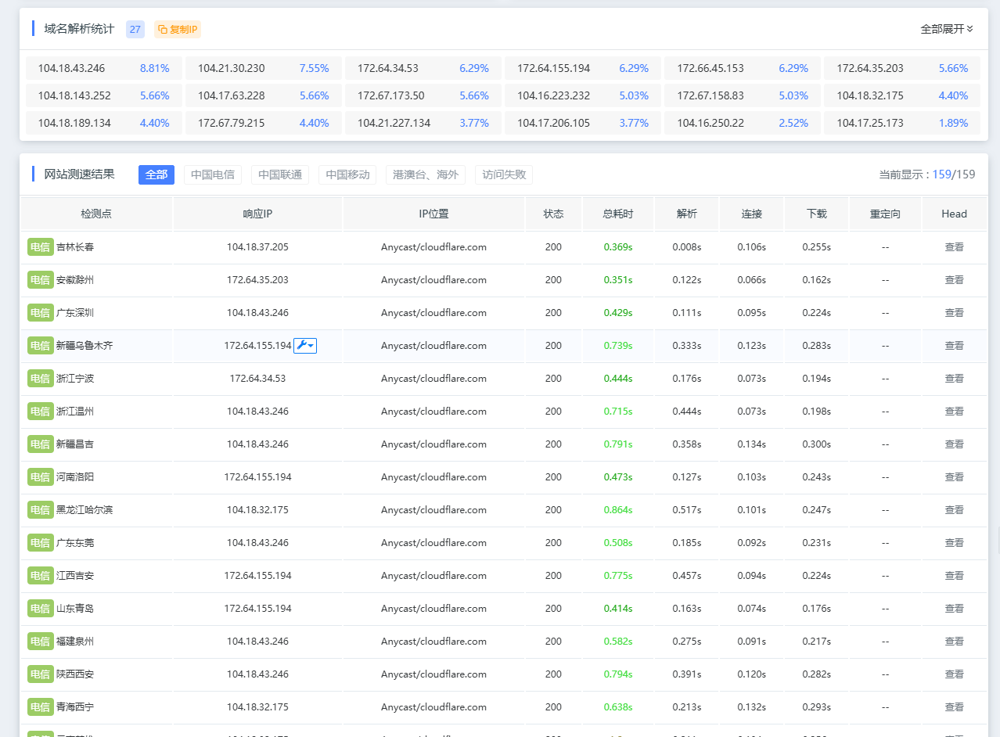

# 三、总结

**Anycast技术本身是很优秀的**。它靠BGP协议实现了智能自动寻路机制，能根据网络拓扑和流量情况动态优化路由选择。Cloudflare在全球330个城市部署的数据中心，也为这种优化提供了硬件基础。

**国内网络环境的特殊性造成了访问困境**。三大运营商的路由策略差异、国际海缆资源分配不均、BGP路由信息传递偏差等，导致国内用户访问Cloudflare境外Anycast时，经常被路由到更远的欧美节点。