## 通过Cloudflare免费配置无限企业级邮箱
Cloudflare是一家专注于提供CDN（内容分发网络）、网络安全防护（含DDoS防御）及域名管理服务的企业，因旗下多项实用服务免费开放，被广泛认可为“高性价比服务提供商”。充分利用我们的免费计划，如何借助Cloudflare及第三方工具，为我们的域名配置可收发邮件的无限企业级邮箱——此类邮箱可满足接收验证码、注册多账号、临时通信等需求，能有效保护个人隐私，避免真实邮箱泄露。

## 配置邮件接收功能（基于Cloudflare邮件路由）
关于免费域名和域名托管 Cloudflare，上期文章已经介绍。完成域名托管后，点击Cloudflare“邮件路由”（Email Routing）功能，从而达成“无限邮箱接收”效果：

1. **进入邮件路由设置**：在Cloudflare账户主页中，点击已托管的域名，以我的域名为例，左侧导航栏选择“电子邮件路由”（Email），再点击“邮件路由”（Email Routing）。

   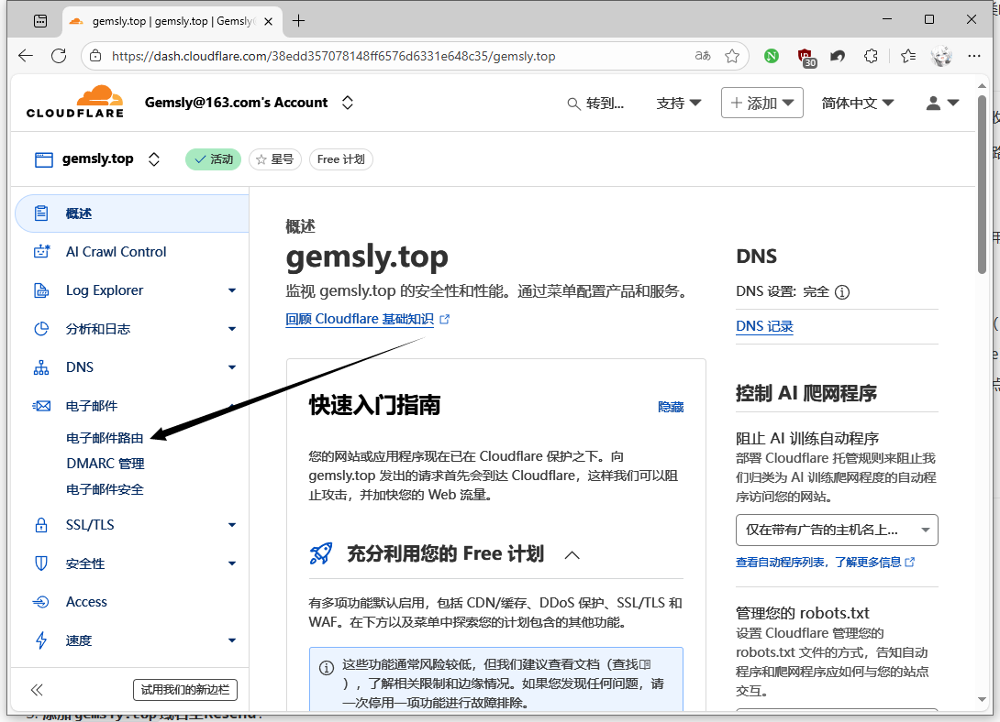

2. **跳过新手引导**：首次进入该页面会弹出“新手设置”（Getting Started）弹窗，点击“取消”（Cancel）以进入自定义配置界面。

   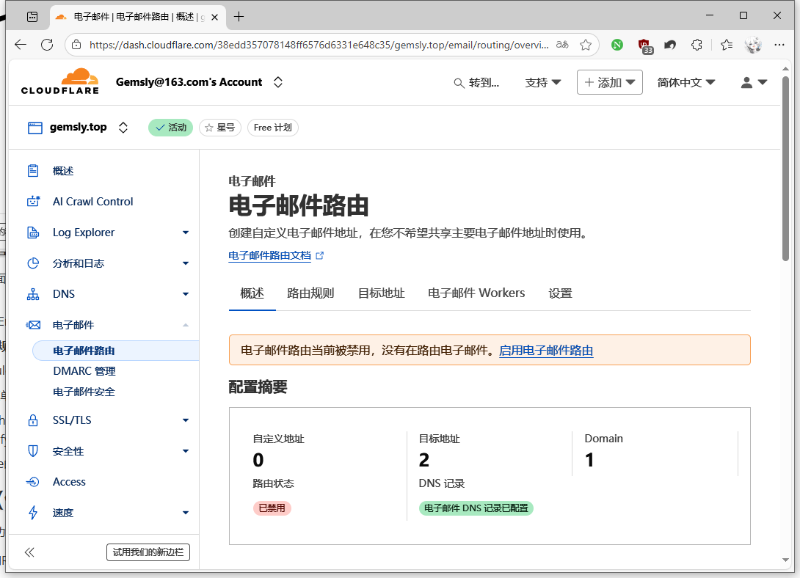

3. **启用邮件路由并添加DNS记录**：点击“启用电子邮件路由”，系统将自动生成4条用于邮件路由的DNS记录。点击“添加记录并启用Cloudflare”（Add Records & Enable Cloudflare），系统会自动完成这4条记录的添加，无需手动操作。

   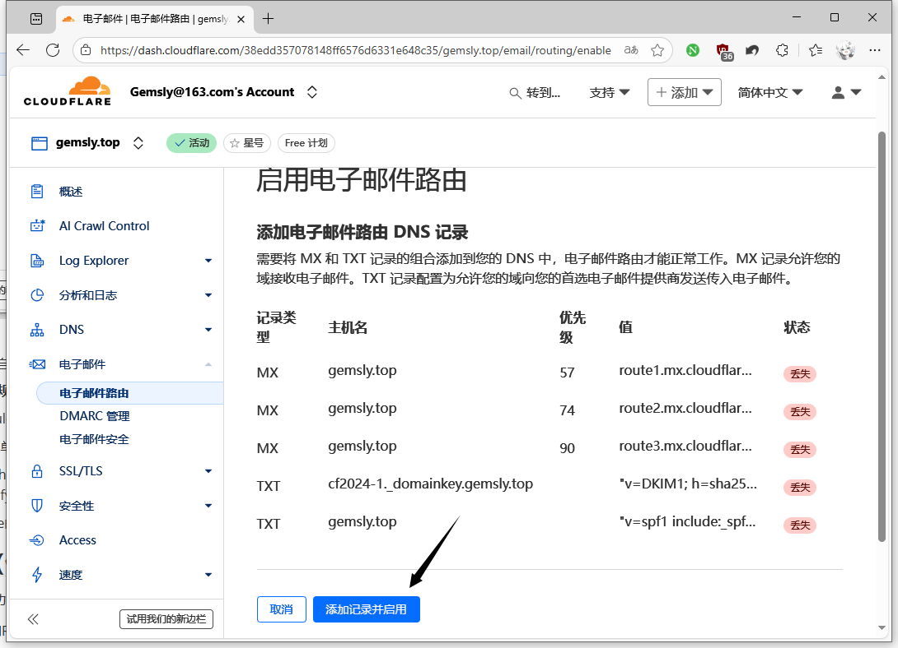

4. **配置“全部接收”（Catch All）规则**：
   - 在“路由规则”（Routing Rules）板块中，找到“Catch All”选项（可匹配`gemslyho.org`域名下所有未单独设置规则的邮箱地址），点击右侧“编辑”；

   - 在“操作”（Action）下拉菜单中选择“发送到电子邮件”，输入用于接收转发邮件的个人邮箱（如163邮箱），点击“保存”（Save）。

     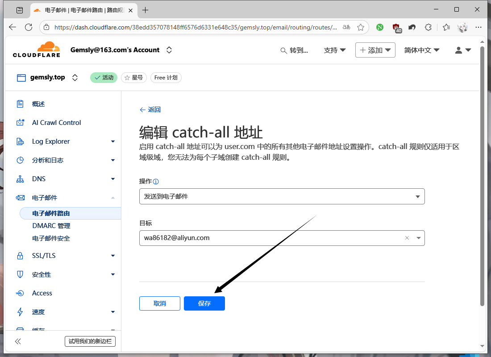

5. **验证接收邮箱**：保存后，如果是首次使用该邮箱，“Catch All”规则状态显示“待验证”（Pending Verification），Cloudflare会向填写的个人邮箱发送验证邮件。登录该邮箱，点击邮件中的蓝色按钮“验证电子邮件地址”（Verify Email Address）链接，完成验证。

   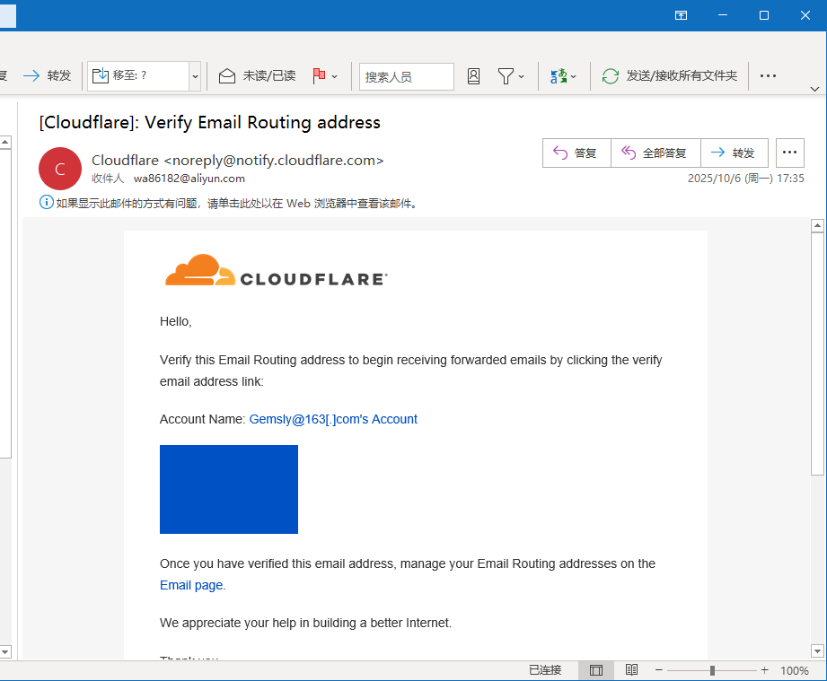

   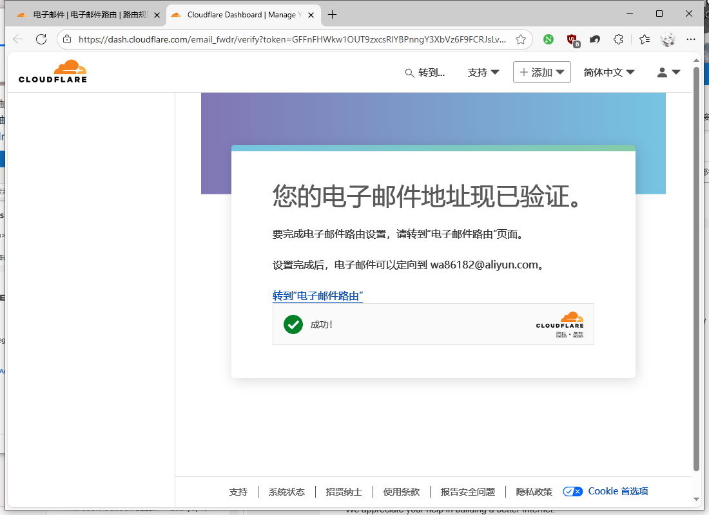

6. **确认配置生效**：返回Cloudflare邮件路由页面并刷新，若“Catch All”规则旁显示对勾，即表示`gemslyho.org`域名的邮件接收功能配置完成。

   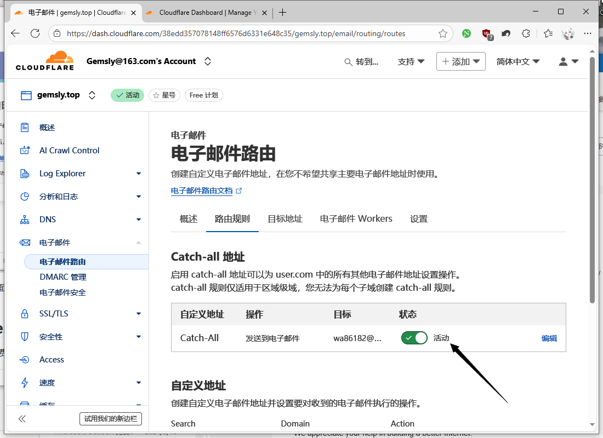

## 配置邮件发送功能（借助Resend.com实现）
Cloudflare仅支持邮件接收，发送功能需借助免费服务Resend.com实现，具体配置步骤如下：
1. **Resend账号注册与登录**：访问Resend.com官方网站，（访问可能稍慢，打不开用加速器，看不懂网页空白处右键翻译），完成账号注册（支持邮箱注册），已有账号则直接登录。

2. **创建Resend API Key**：

   - 左侧导航栏选择“API Keys”，点击“创建API Key”（Create API Key）；

   - 自定义API Key名称可以随意写一个，下方两项设置保持默认，点击“添加”（Add）；

     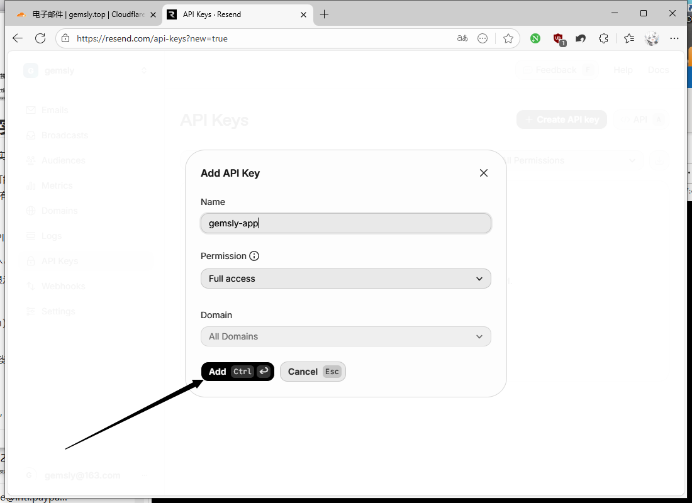

   - 生成API Key后，需立即复制保存，这个只会显示一次，随便写在一个地方。

     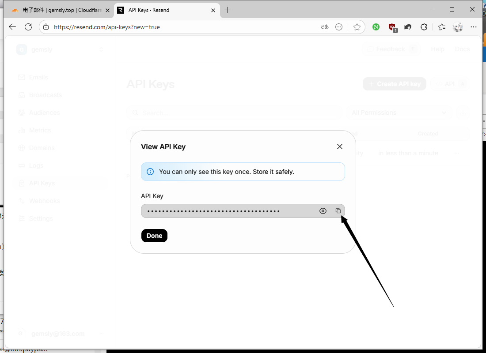

3. **添加`gemslyho.org`域名至Resend**：

   - 左侧导航栏选择“Domains”，点击“Add Domain”，以我的域名为例，输入你自己的域名，地区可以选一个离自己近的，点击“添加”；

     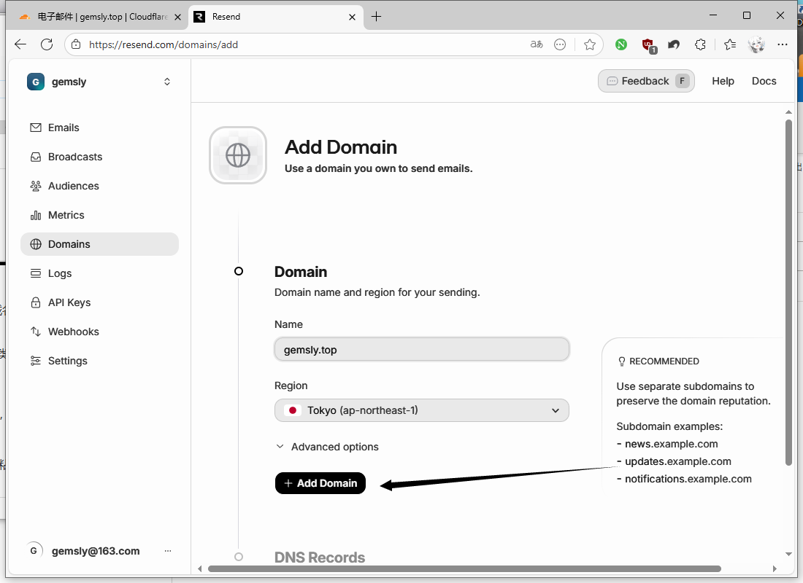

   - 系统将生成3条用于邮件发送的DNS记录，记录每条记录的“类型”“名称”“值”及“优先级”（MX记录优先级为10）。用 Cloudflare 托管的域名是能一键设置的，点击登录 Cloudflare 就能一键设置。

     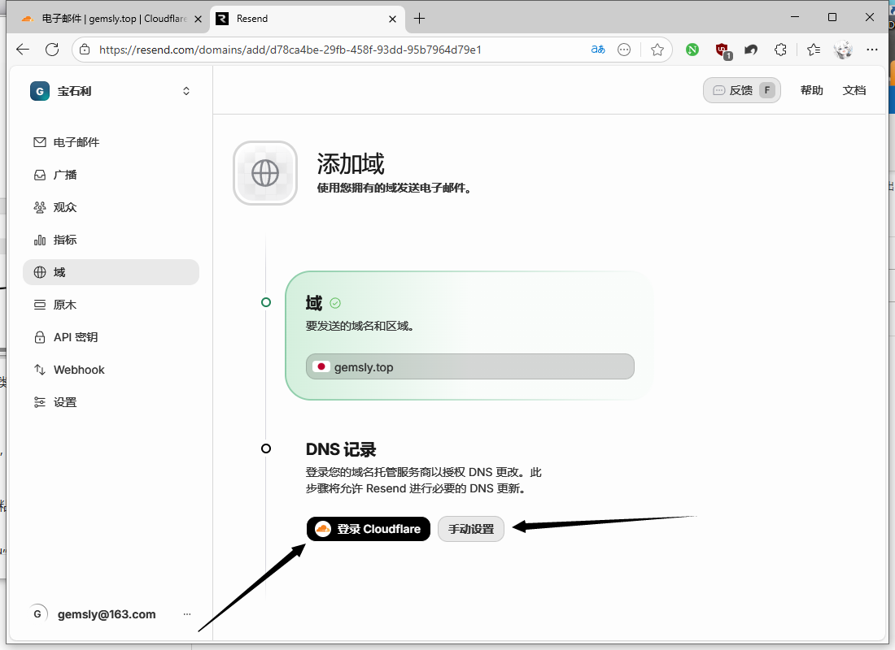

     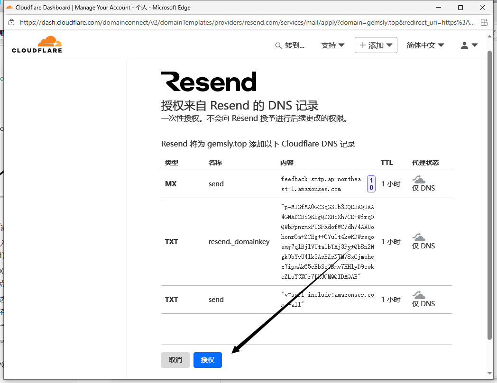

4. **手动添加Cloudflare中的Resend所需DNS记录**：

   - 登录Cloudflare控制台，进入`gemslyho.org`域名的“DNS记录”（DNS Records）页面，点击“添加记录”（Add Record），按以下步骤添加3条记录：
     1. **MX类型记录**：选择“MX”类型，“名称”填写“send”，“值”粘贴Resend生成的MX记录值，“优先级”填写10，点击“保存”；
     2. **第一条TXT类型记录**：选择“TXT”类型，“名称”填写“send”，“值”粘贴Resend生成的第一条TXT记录值，点击“保存”；
     3. **第二条TXT类型记录**：选择“TXT”类型，“名称”按Resend提示填写，“值”粘贴Resend生成的第二条TXT记录值，点击“保存”。

5. **验证Resend域名配置**：返回Resend控制台的域名配置页面，点击“验证DNS记录”（Verify DNS Records），系统将检查Cloudflare中添加的记录是否正确。待3条记录均显示绿色“已验证”状态，即表示邮件发送的前置配置完成。

   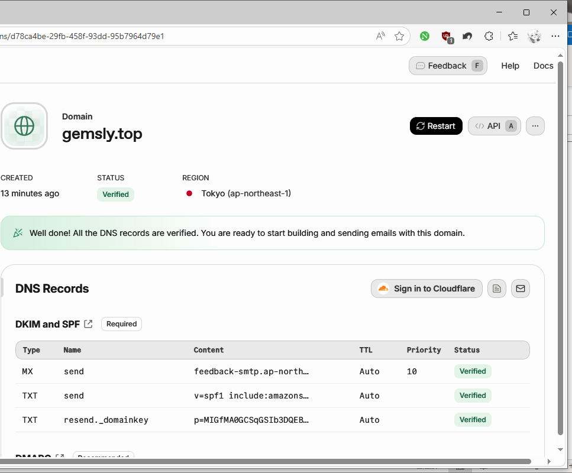

## 邮件功能测试
### 邮件接收测试
1. 使用任意邮箱（如Outlook）撰写测试邮件，“收件人”填写`任意前缀@你自己的域名`（如contact@gemslyho.org，前缀可自定义），填写主题与正文后发送；

   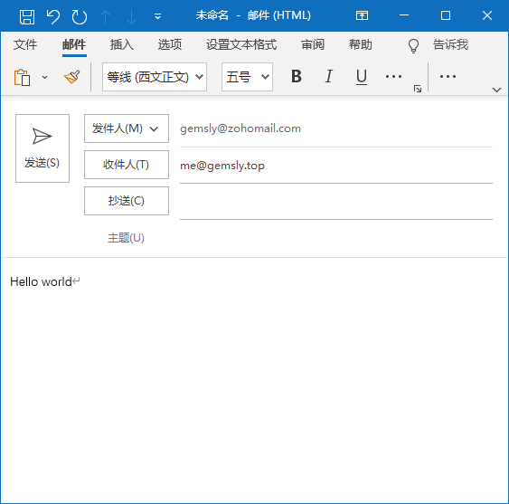

2. 登录在Cloudflare邮件路由中设置的转发邮箱（如163邮箱），查看是否收到测试邮件。若能正常接收，说明“无限邮箱接收”功能生效——所有发送至`gemslyho.org`域名下任意邮箱地址的邮件，均会自动转发至该转发邮箱。

   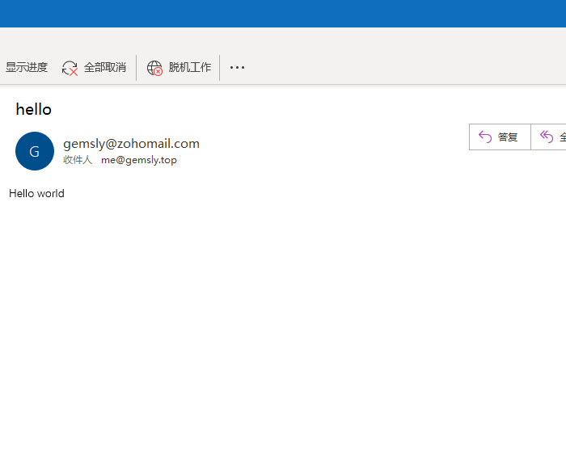

### 邮件发送测试
邮件发送可通过代码或终端命令实现，以下为两种常用方式的测试步骤：
#### 1. Python代码方式（适用于有编程基础的用户）
1. **安装Resend依赖库**：打开终端（Terminal），执行命令`pip install resend`，完成Resend Python SDK的安装；
2. **编写发送代码**：
   - 复制Resend控制台“Emails”板块中的Python示例代码，在代码编辑器（如VS Code、Pycharm）中打开；
   - 替换关键参数：将“api_key”替换为刚刚保存的Resend API Key；“from”字段填写`任意前缀@自己的域名`（如contact@gemslyho.org）；“to”字段填写接收邮件的邮箱（如自己的或别人的Outlook邮箱）；“subject”（主题）与“html”（正文）可自定义；
   - 删除代码中无关的附件发送逻辑（若无需发送附件）。
3. **运行代码并验证**：执行代码，若运行无报错，登录在代码中指定的邮箱，查看是否收到测试邮件。若能正常接收，说明邮件发送功能生效。

#### 2. curl命令方式（适用于Linux终端或Windows PowerShell）
1. 复制Resend控制台提供的curl示例命令，在终端中打开；我没有终端，我用在线 post 演示。这里我们复制下来 curl 的网页 api ：

   `curl -X POST 'https://api.resend.com/emails' \`
    `-H 'Authorization: Bearer re_xxxxxxxxx' \`
    `-H 'Content-Type: application/json' \`
    `-d $'{`
     `"from": "Acme <onboarding@resend.dev>",`
     `"to": ["delivered@resend.dev"],`
     `"subject": "hello world",`
     `"html": "
it works!
"`
   `}'`

2. 替换关键参数：将“Authorization: Bearer re_xxx”中的“re_xxx”替换为刚刚保存的Resend API Key；“from”字段替换为`任意前缀@自己的域名`前面的 Acme替换成自己的发件人名字；“to”字段替换为接收测试邮件的邮箱，修改后的字段大概是这样的：

   `curl -X POST 'https://api.resend.com/emails' \`
    `-H 'Authorization: Bearer 自己的 api 密钥' \`
    `-H 'Content-Type: application/json' \`
    `-d $'{`
     `"from": "Gemsly <contact@gemslyho.org>",`
     `"to": ["wa86188@2980.com"],`
     `"subject": "hello world",`
     `"html": "
hello world
"`
   `}'`

此外，也可将curl命令导入Postman等接口测试工具，通过工具发送邮件（导入方式：Postman点击“Import”，粘贴curl命令后确认导入，点击“Send”即可）。

## Resend免费计划说明
Resend提供免费使用计划，该计划下每月可发送3000封邮件，每日发送限额为100封，完全能满足个人用户的日常使用需求（如接收验证码、临时通信等场景）。

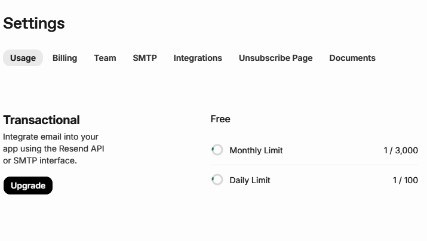

## 总结
本文主要介绍了如何利用 Cloudflare 和 Resend 等免费服务，为自己的域名配置无限多个企业级邮箱，实现邮件自由收发、小号邮箱的操作。