今天折腾了一下 Cloudflare Zero Trust，发现这个服务居然在国内又能用了，而且还有点意外。

## 下载和配置Zero Trust

直接在你的 CloudFlare 主页，左侧菜单栏点“Zero Trust”，首次进入的话，随便写个团队名称，套餐选免费计划就行。不过它会让你绑定付款方式，这时候直接点右上角“取消并退出”，再点一次“Zero Trust”，就能直接进主页了。

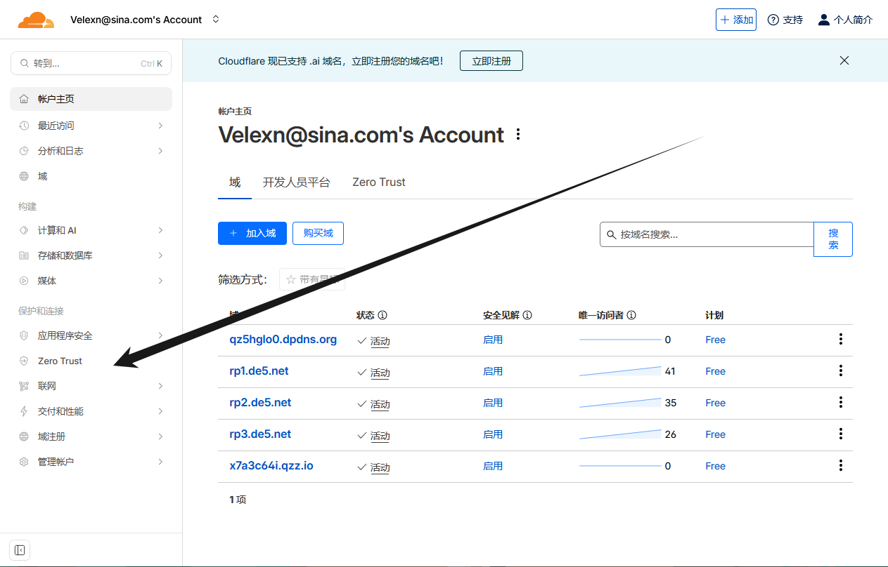

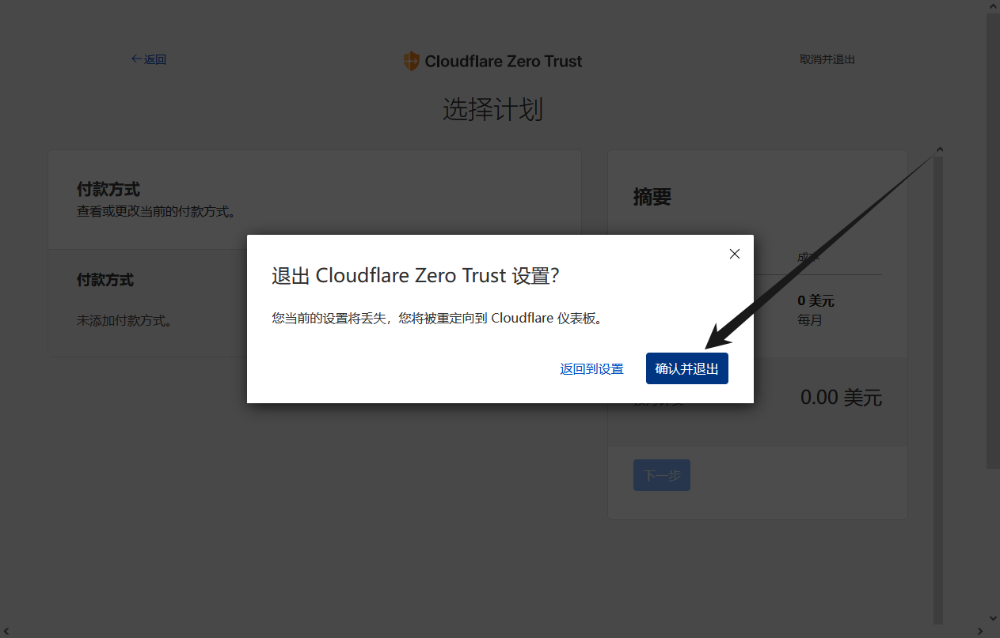

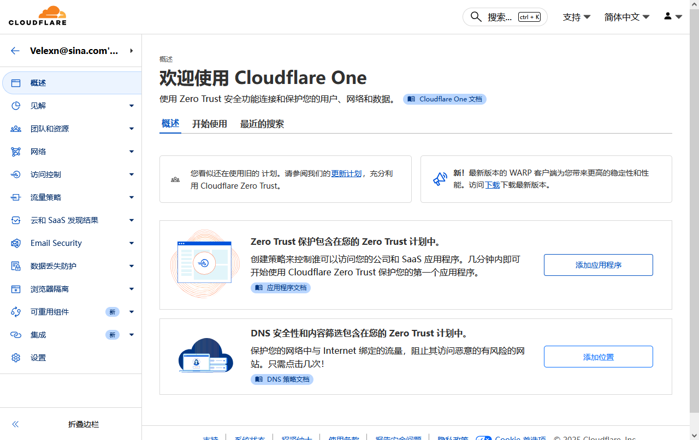

进入主页后，先展开团队资源，再点“设备”。如果进去提取资源时出错，等几分钟再点“添加设备”就行。

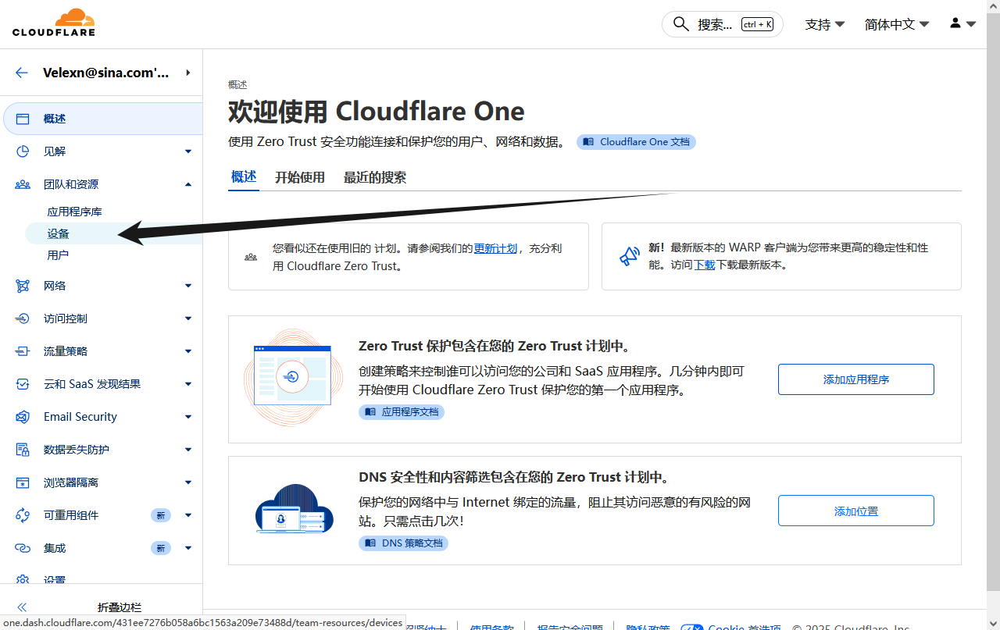

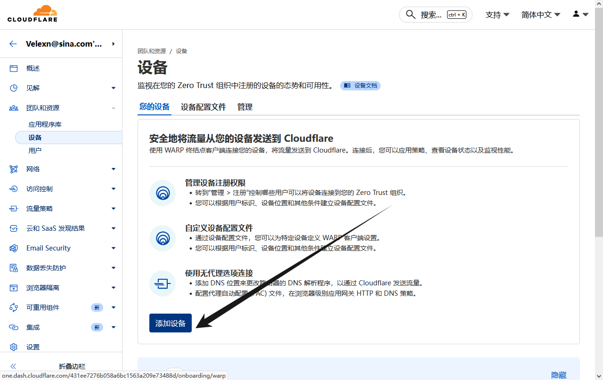

点“添加设备”后，继续按钮是灰的，直接点“下载发行版本”，然后忽略打开的新标签页，而是返回Cloudflare One 页面，继续按钮就能用了。安装的时候一般一路点下一步就行，中间的设置改不改都可以。

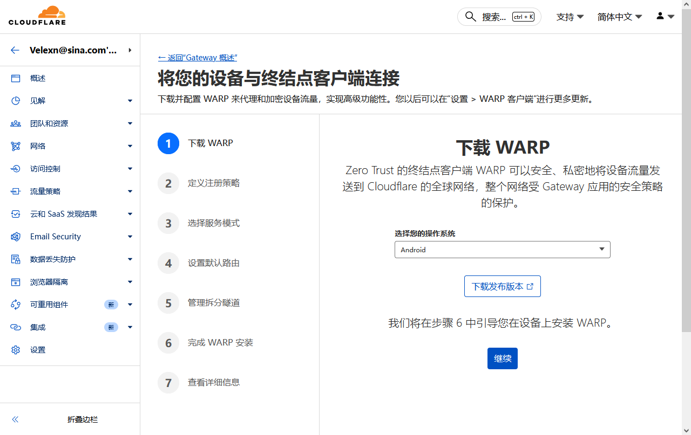

### （一）Windows 端配置步骤

在刚才的下载发行版本页面，下载 Windows 安装包，点“Next”再点“Install”。首次弹出窗口点下一步，接受许可条款，其实这时候就已经能用上了。

连接 Zero Trust 的方法：点任务栏里的 Cloudflare Warp 徽标，选齿轮图标→“偏好设置”，再进“账户”选项卡，用“Cloudflare Zero Trust”登录。同样要接受条款，然后输入刚才创建 Cloudflare One 时的团队名称，会弹出浏览器，输入你注册 Cloudflare 时的邮箱，点“Send me a code”，再填邮箱收到的验证码。

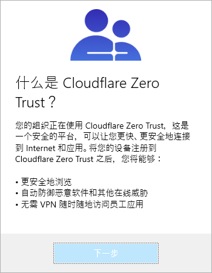

出现成功页面后，记得选浏览器提示的“打开 Cloudflare Warp”，不然授权会失败。可以点“连接”试试能不能连上 Cloudflare 网络，如果连不上，就去刚才的 Cloudflare One 设备页，删掉多余的设备配置文件，点“编辑”，建议把模式切换成打开状态，这样客户端就不会锁死在 Warp 网关，能自由选 DoH 还是全局代理。默认的 MASQUE 可以换成 WireGuard，记得滑到页面底部点“保存配置文件”。

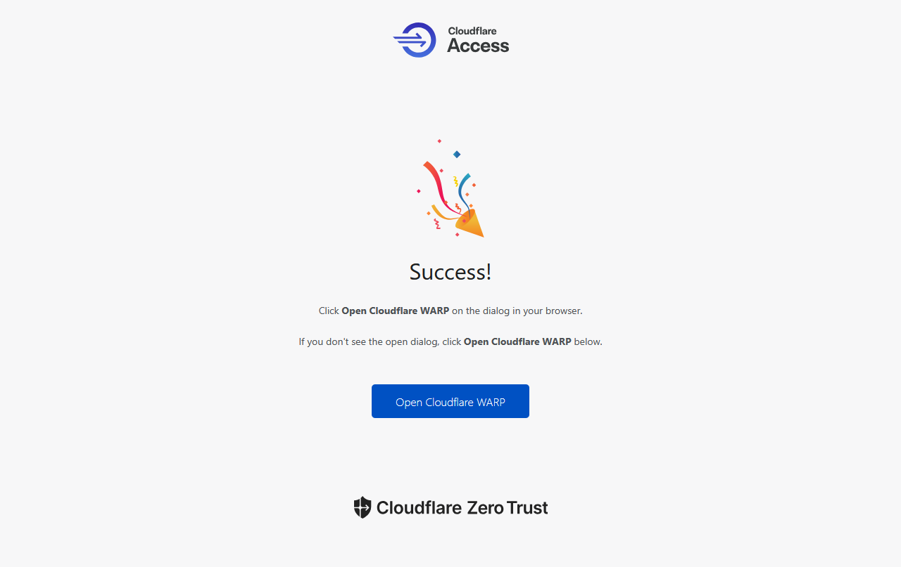

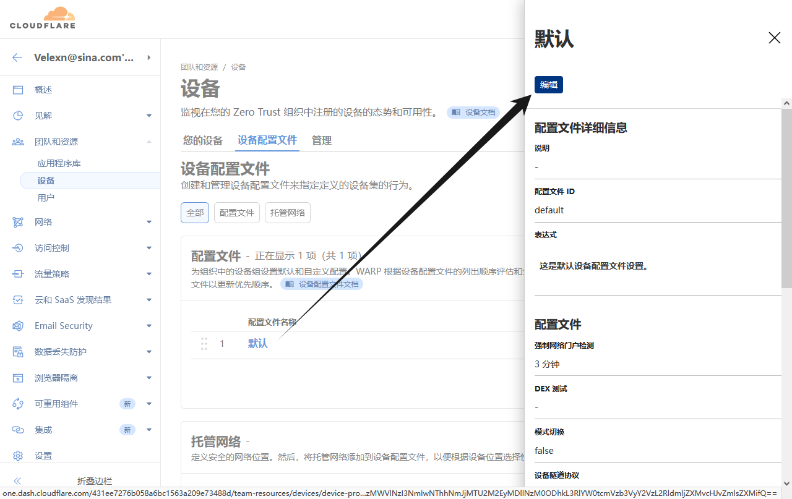

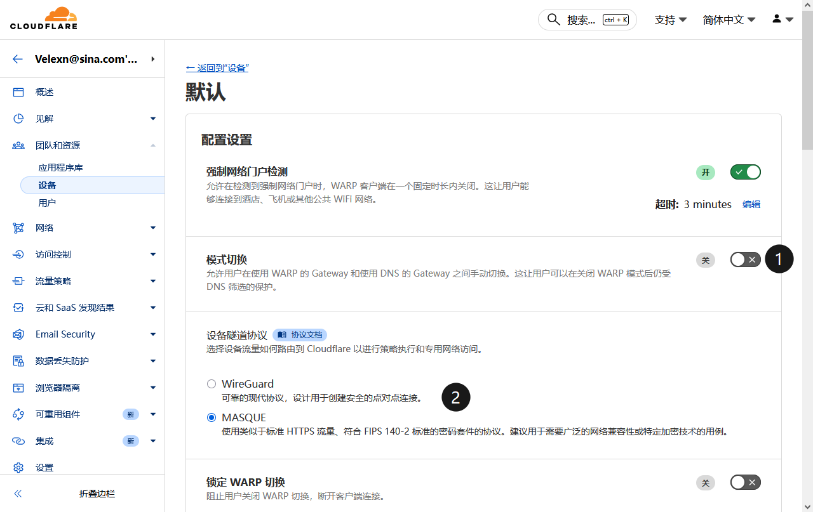

### （二）安卓端配置步骤

安卓手机可以从 Play 商店下载 Cloudflare One，安卓端需要登录，电脑端倒是免登录就能用保护功能。

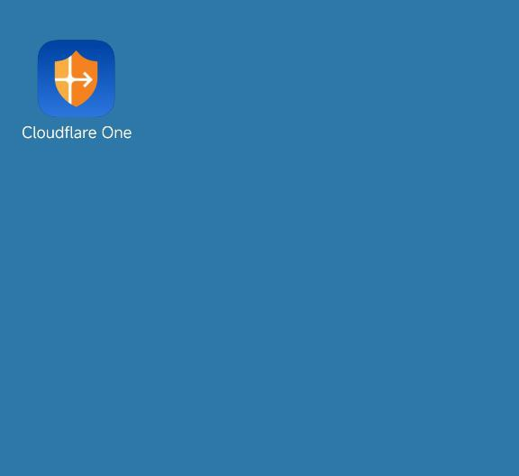

首先接受隐私条款，输入刚才在 Cloudflare One 创建的团队名称，点击下一步会弹出浏览器窗口，输入注册时的电子邮箱，点“发送验证码”，输入验证码后，同样要快速点一下“允许网站打开应用”按钮，完成授权。

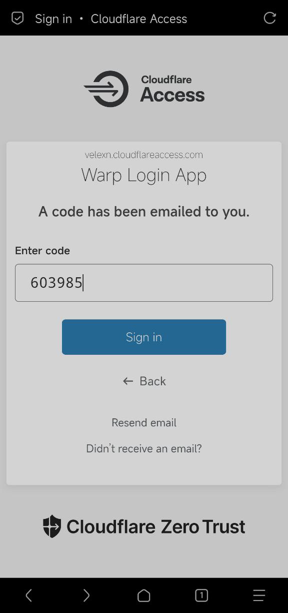

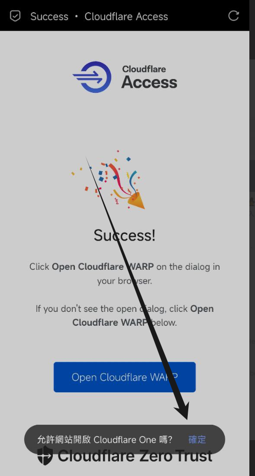

接受应用发送的通知，试着连接一下，一般都能连上。如果连不上，可能是当地运营商限制了，可以去 Cloudflare One 后台编辑默认规则，切换一下连接协议。

## 测评

连接上 Warp 网关后，打开 IP 检测网站[https://ping0.cc](https://ping0.cc)，发现 IP 位置显示中国境内，还是很罕见的国内 Cloudflare 节点，运营商显示 CLOUDFLARENET，估计寻路机制是按最近距离分配的。

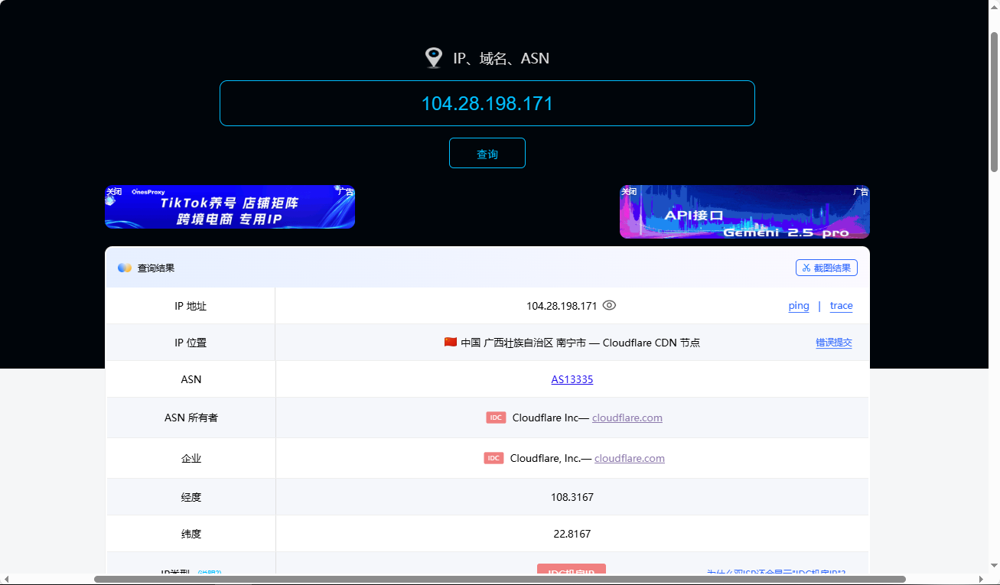

[IP归属地查询 - 在线工具](https://tool.lu/ip/)

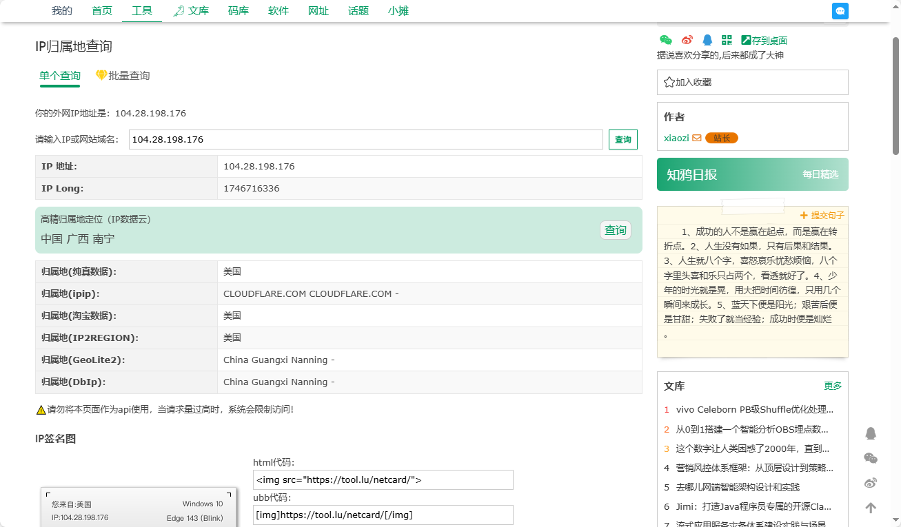

[浏览器信息检测](https://detect.gemslyho.org/)

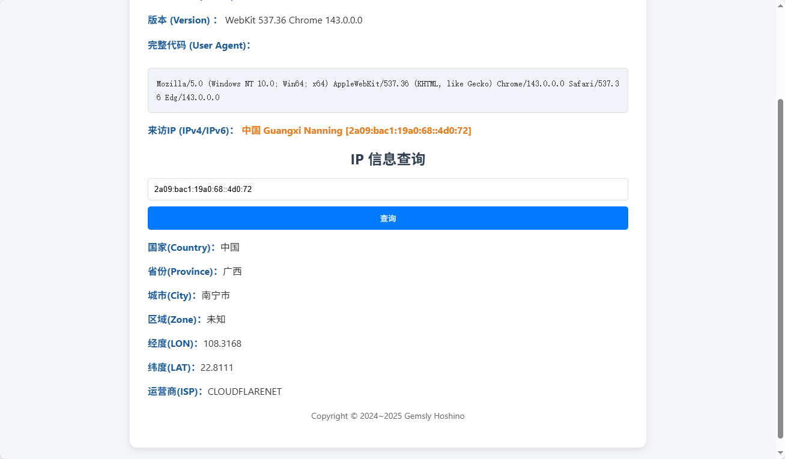

可能因为国外测速节点的原因，速度不是特别好（[https://www.speedtest.net/](https://www.speedtest.net/)）

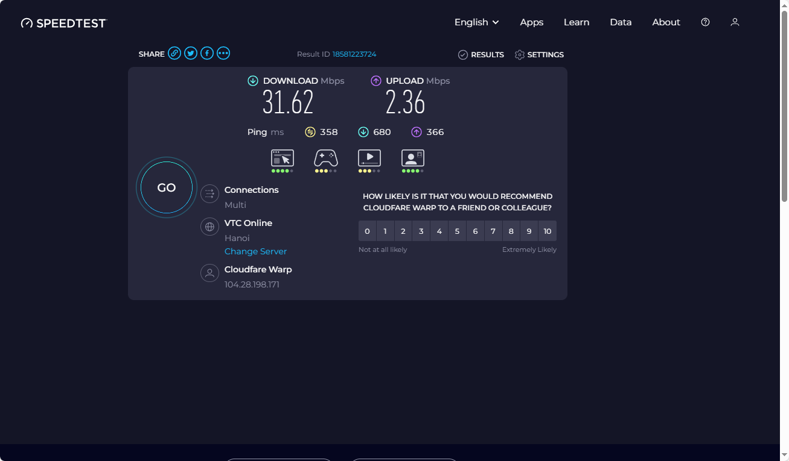

打开 [Google](https://www.google.com)，随便输个搜索关键词，滑动到搜索结果底部，会显示 IP 地址是中国和分配给你的节点。

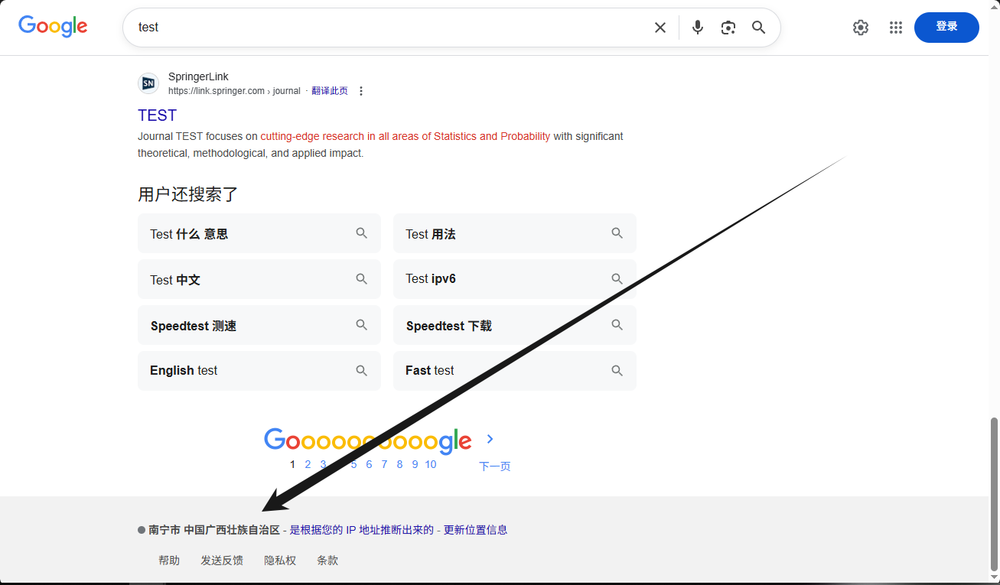

Telegram 登录设备显示中国和给你分配到的节点。

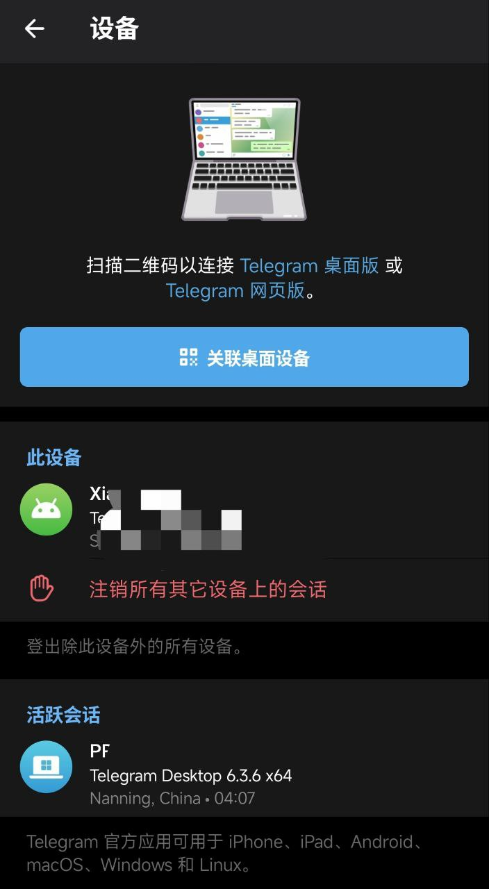

## 结尾

总的来说，这次这次Cloudflare Zero Trust 这次国内“复活”还挺让我意外的，对于有基础网络需求的小伙伴来说来说足够用了。

测速不算顶，可能跟国外节点有关...并且好像延迟特别高，明明数据中心就在国内，但是延迟300毫秒，不知道是怎么回事。