# 个人使用过的邮件服务提供商

当下市场即时通讯软件独领风骚，但在欧美等地区，电子邮件仍然是主流的交流方式之一，包括注册许多国外网站或许都需要一个 Email，个人评价一下使用过的邮箱，个人使用过程中的一些感受。

## 国内邮箱

### 1. 网易邮箱

- 服务商：网易

- 特点：国内老牌个人邮箱代表，上线时间早、用户基数庞大。功能丰富（大容量存储、智能分类、强垃圾邮件过滤），界面简洁易用，个人与小型团队场景覆盖广泛。个人主力邮箱稳定使用。

- 后缀：163.com/126.com/yeah.net

- 网址：[https://email.163.com](https://email.163.com)

  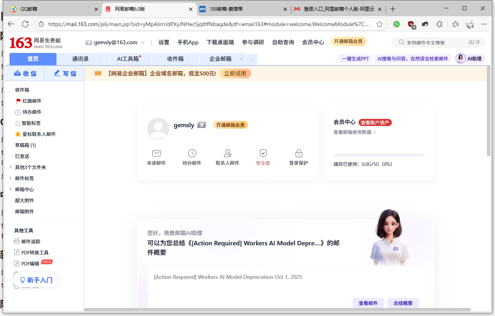

### 2. QQ 邮箱

- 服务商：腾讯（Tencent）

- 特点：依托腾讯 QQ 社交生态，注册 / 登录极便捷（可直接关联 QQ 账号）。整合 QQ 好友、腾讯文档等生态功能，作为本人备用邮箱，可以注册一个Foxmail或者QQ别名。

- 后缀：qq.com/foxmail.com

- 网址：[https://mail.qq.com](https://mail.qq.com)

  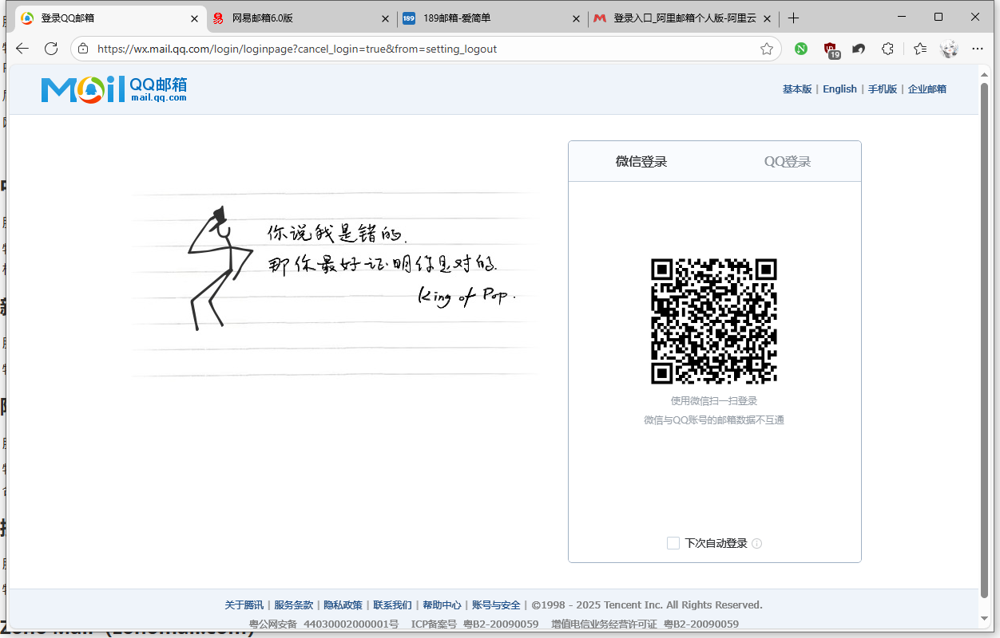

### 3. 139 邮箱

- 服务商：中国移动

- 特点：面向移动用户的邮箱服务，可直接用手机号注册。结合运营商优势，支持 “短信新邮件提醒”“话费 / 流量账单推送” 等功能，适合统一管理通讯与运营商相关信息。有时候会推一堆话费云盘账单，要手动设置黑名单。移动卡可以设置3个别名。

- 后缀：139.com

- 网址：[https://mail.10086.cn](https://mail.10086.cn)

  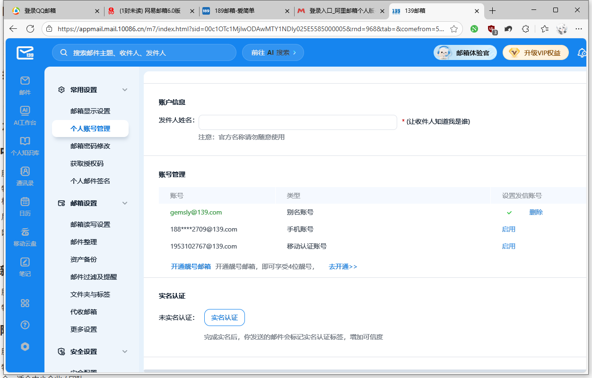

### 4.189邮箱

- 服务商：中国电信

- 特点：面向电信用户的邮箱服务，不过移动号码也能验证码登录。目前看来比较干净，附件可以联动云盘。21CN不知道如何登录。

- 后缀：189.cn/21cn.com

- 网址：[https://mail.189.cn](https://mail.189.cn)

  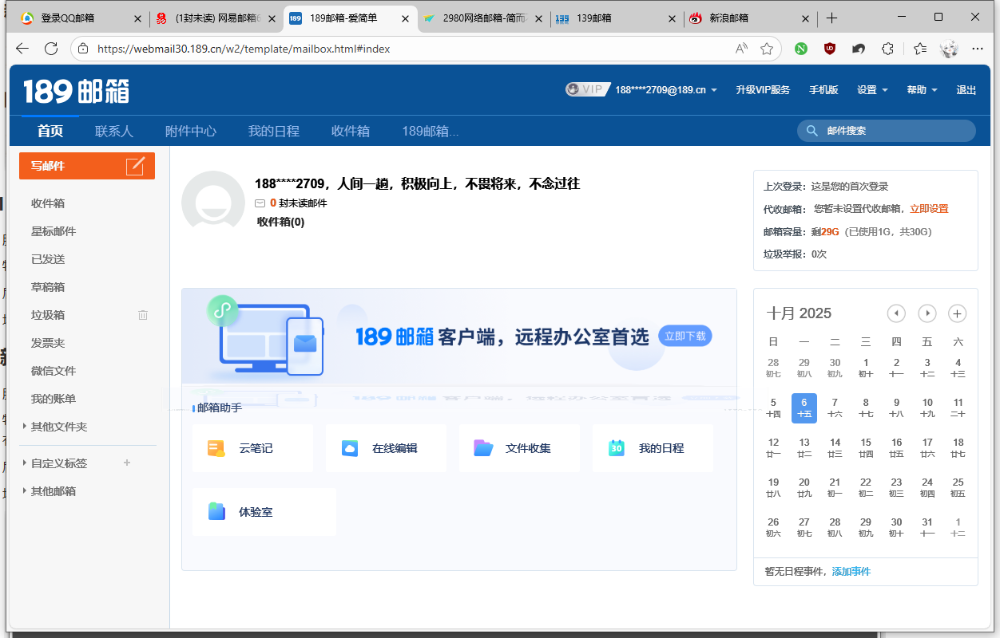

### 5. 新浪邮箱

- 服务商：新浪

- 特点：国内老牌门户类邮箱，曾因新浪博客、新闻生态广泛使用。提供基础邮件收发、文件夹管理等功能，界面偏传统，仍有大量长期用户留存。移动端广告有点多，首次注册强行下载移动端激活。

- 后缀：sina.com/sina.cn

- 网址：[https://mail.sina.com](https://mail.sina.com)

  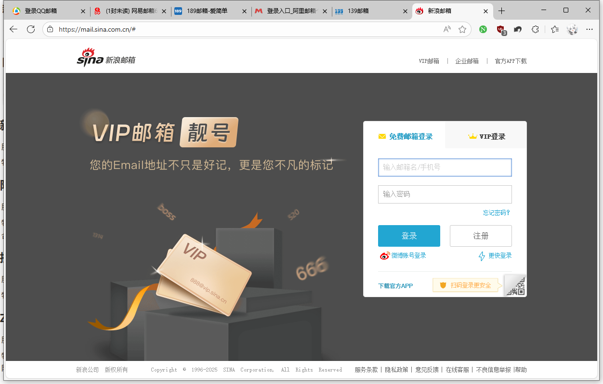

### 6. 阿里云邮箱

- 服务商：阿里云

- 特点：主打企业级服务，强调稳定性、安全性与可定制性。支持 “企业域名绑定”“团队协作管理（权限 / 分组）”，有时候会误报垃圾邮件，要求解封。但是目前似乎关闭了个人的注册通道。

- 后缀：aliyun.com

- 网址：[https://mail.aliyun.com](https://mail.aliyun.com)

  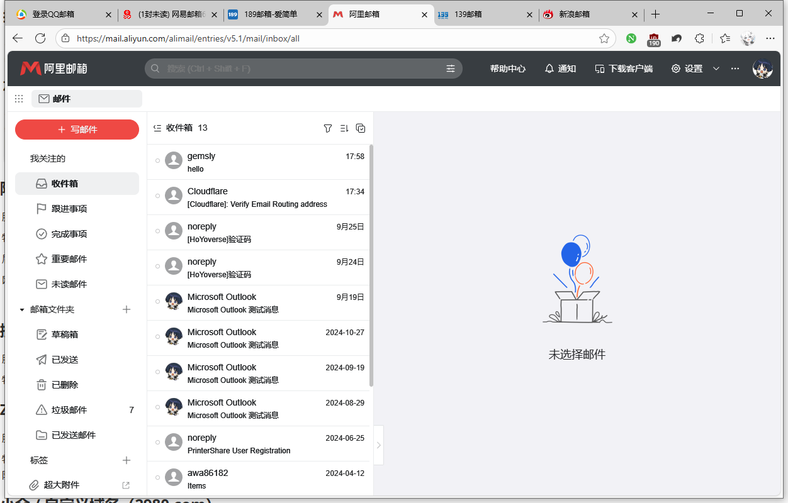

### 7. 搜狐邮箱

- 服务商：搜狐（Sohu）

- 特点：门户背景的电子邮箱服务，功能实用（基础收发、通讯录管理），界面偏向传统，适合个人 “轻量使用”。有时候 IMAP 会莫名其妙无响应。

- 后缀：sohu.com

- 网址：[https://mail.sohu.com](https://mail.sohu.com)

  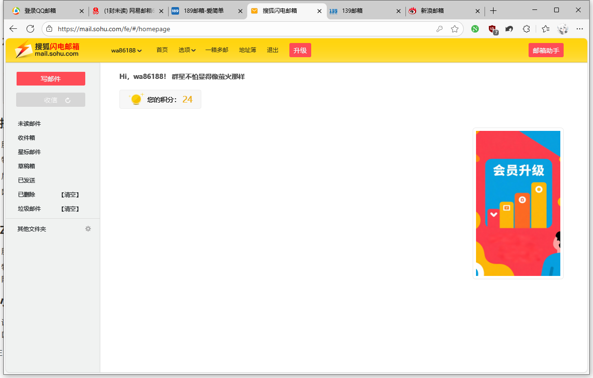

### 8. 2980网络邮箱

- 服务商：多益网络

- 特点：偏向小众化，服务商是一家游戏公司，界面比较现代，IMAP 密钥有效期只有半年，有时候邮件发不出去退信。

- 后缀：2980.com

- 网址：[https://2980.com](https://2980.com)

  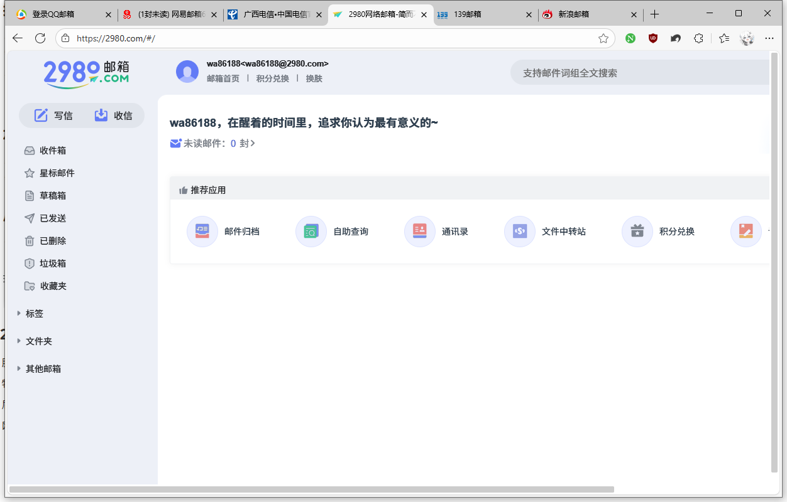

### 9. TOM邮箱

- 服务商：新飞网络

- 特点：以前有免费邮箱服务，现在返回付费邮，注册就要求交钱，并且速度不一定有保证。

- 后缀：163.net/163vip.com/tom.com

- 网址：[https://mail.tom.com](https://mail.tom.com)

  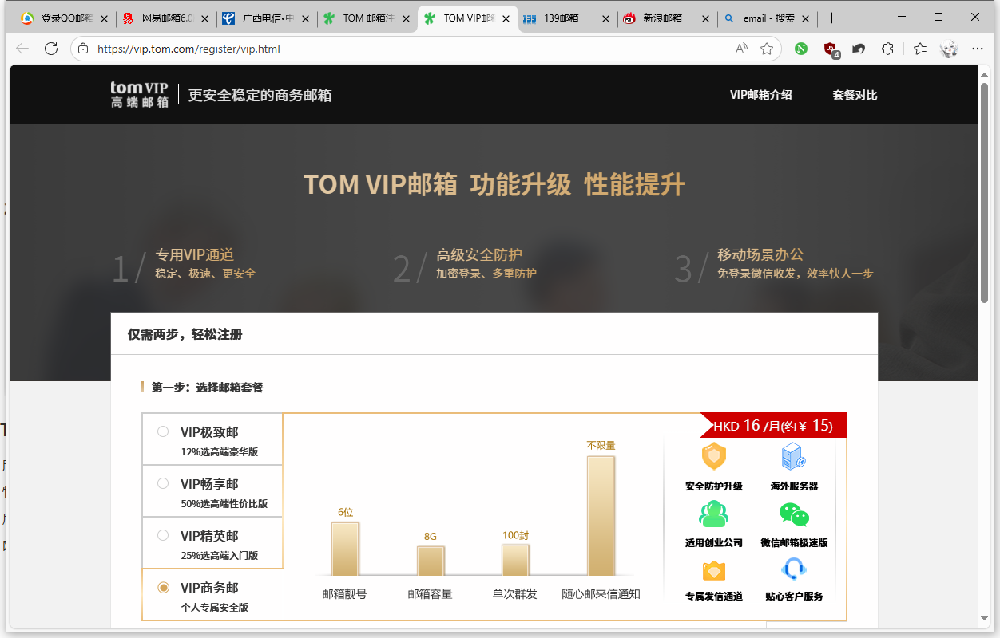

### 10. 完美邮箱

- 服务商：完美世界

- 特点：支持个人自定义二级域名的定制个人免费电子邮箱，作为完美邮箱家族旗下全新上线，只能在白天特定时间段注册。

- 后缀：email.cn/88.com/111.com

- 网址：[https://www.email.cn](https://www.email.cn)

  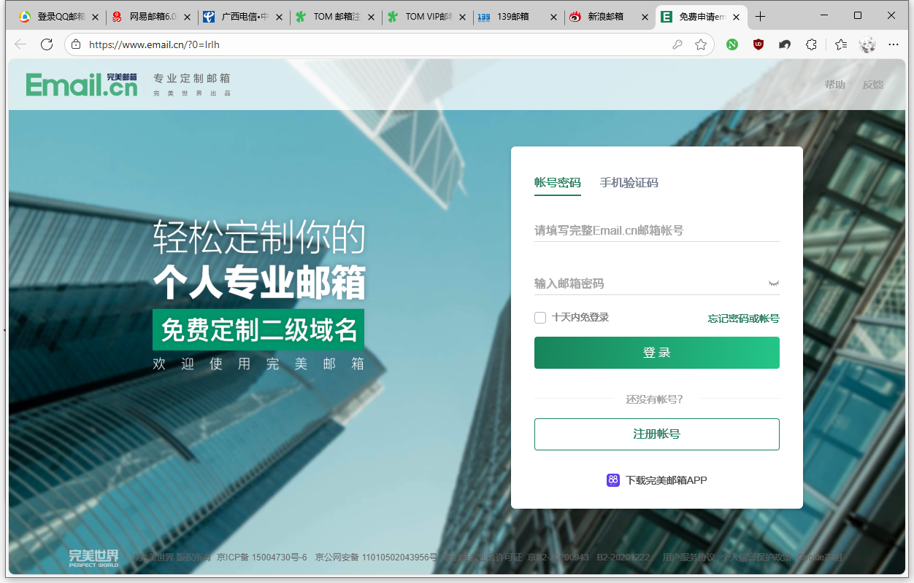

### 11.沃邮箱

- 服务商：中国联通

- 特点：面向联通用户的邮箱服务，不过移动号码也能验证码登录。目前看来比较干净，页面比较复古。

- 后缀：wo.cn

- 网址：[https://mail.wo.cn](https://mail.wo.cn)

  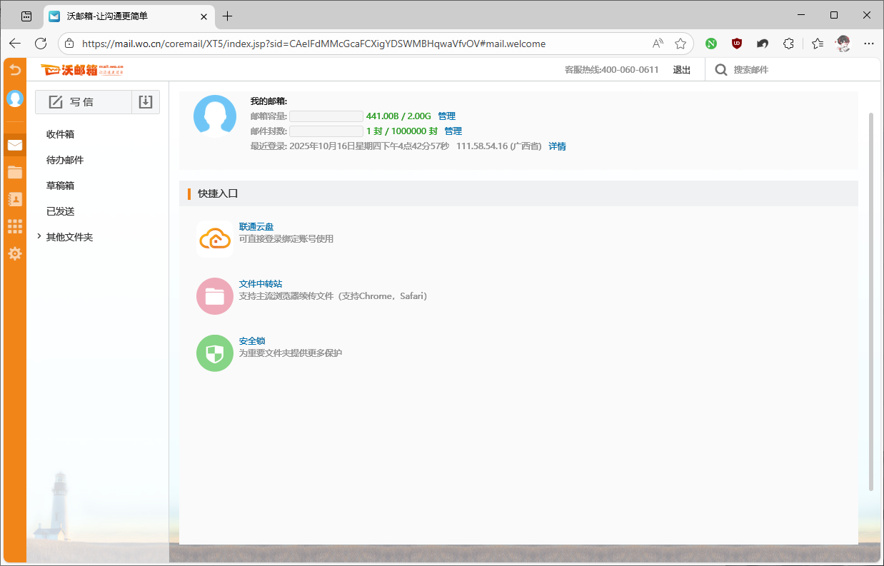

### 12.263个人邮箱

- 服务商：263企业通信有限公司

- 特点：付费邮箱，每月大概十到20元左右。

- 后缀：263.net

- 网址：[https://www.263.net/](https://www.263.net/)

  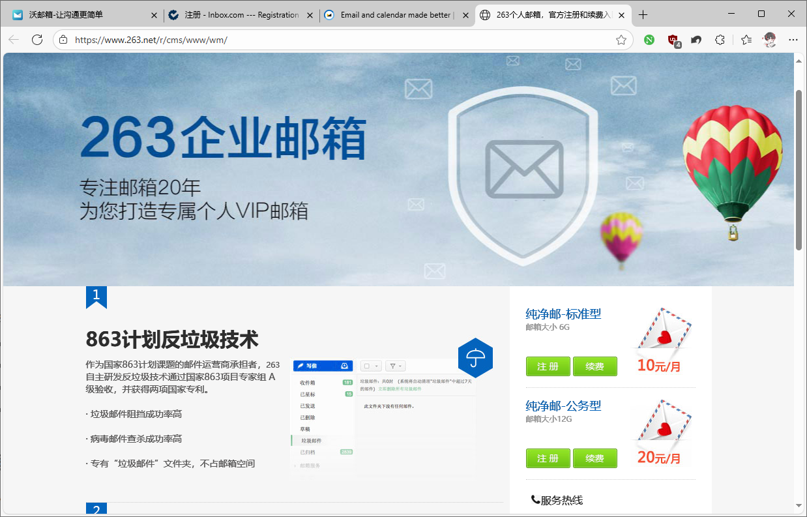

### 13.花瓣邮箱

- 服务商：华为

- 特点：支持华为账号登录的个人免费电子邮箱，作为Petal旗下全新上线，可以用华为账号登录。

- 后缀：petalmail.com

- 网址：[https://petalmail.com](https://petalmail.com)

  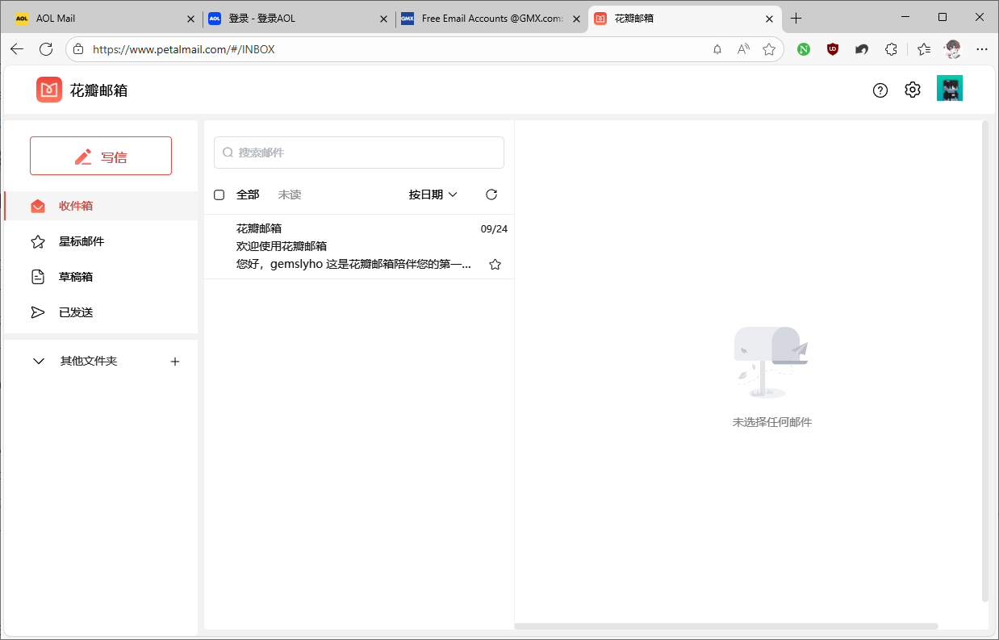

## 国外邮箱

### 1. Gmail

- 服务商：Google

- 特点：互联网上最著名的邮箱之一，有庞大用户群体，大多数网站和应用注册都认这个邮箱。国内注册要开加速器，同步不方便。

- 后缀：gmail.com

- 网址：[https://mail.google.com/](https://mail.google.com/)

  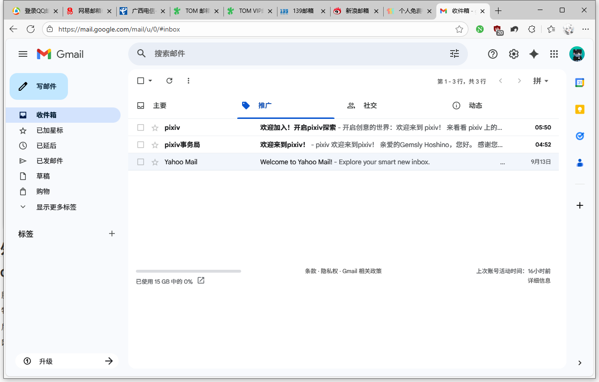

### 2. Outlook

- 服务商：Microsoft

- 特点：也是互联网上受欢迎的邮箱之一。微软推出的邮箱服务，此前有 live 和 msn 的后缀。

- 后缀：hotmail.com/outlook.com

- 网址：[https://outlook.com](https://outlook.com)

  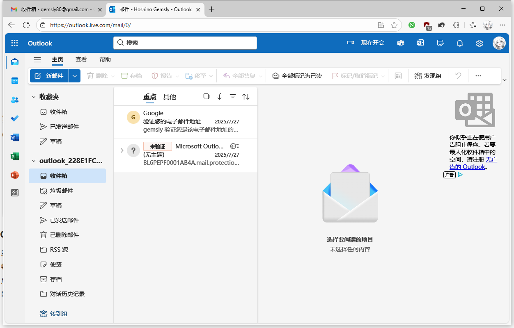

### 3. Proton Mail

- 服务商：Proton

- 特点：注重隐私保护，邮件有加密，创建账户简单，只需要一个恢复邮箱，国内访问要开加速器。

- 后缀：proton.me/protonmail.com

- 网址：[https://mail.proton.me](https://mail.proton.me)

  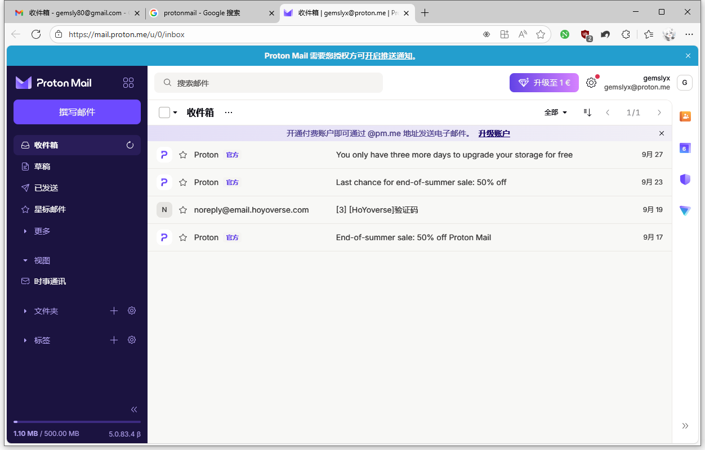

### 4. Zoho Mail

- 服务商：Zoho

- 特点：偏向商务化，验证码通知会放在 Notification 文件夹里，新用户容易找不到，国内可直连，cn 后缀访问较快，com 走国际服务器，同步比较慢。

- 后缀：zohomail.com/zoho.com.cn

- 网址：[https://mail.zoho.com](https://mail.zoho.com)

  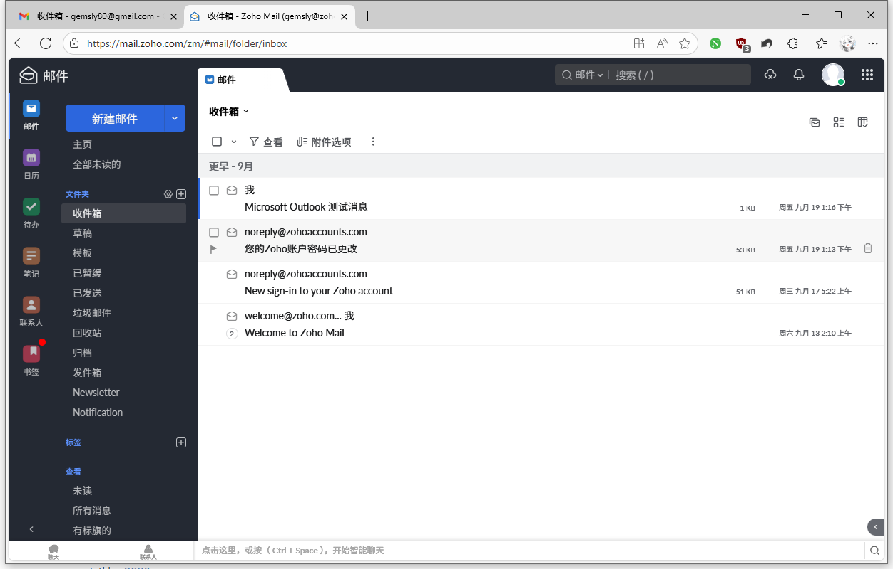

### 5. Mail.com

- 服务商：mail&media

- 特点：有许多后缀可供选择，国内网络无法注册，无86号码验证选项，需自备海外号码。

- 后缀：mail.com/email.com...

- 网址：[https://mail.com](https://mail.com)

  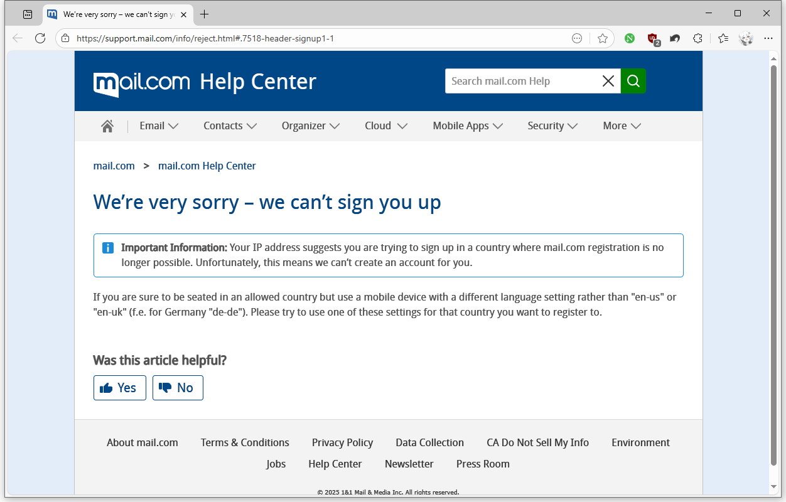

### 6. Yahoo

- 服务商：雅虎公司

- 特点：已经退出中国，没有86号码验证选项需自备国外号码，可用 Google 登录，但似乎无法创建Email账号。

- 后缀：yahoo.com/myyahoo.com

- 网址：[https://mail.yahoo.com](https://mail.yahoo.com)

  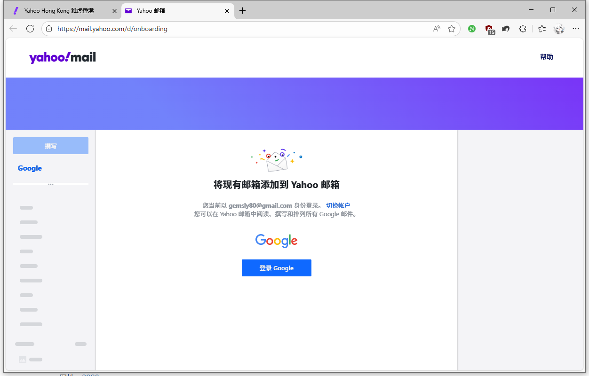

### 7. Yandex

- 服务商：Yandex

- 特点：一家来自俄罗斯的公司，国内可直连，但速度较慢，有时候收不到信，可用86号码注册，免费版有广告。

- 后缀：yandex.com/aol.com

- 网址：[https://mail.yandex.com](https://mail.yandex.com)

  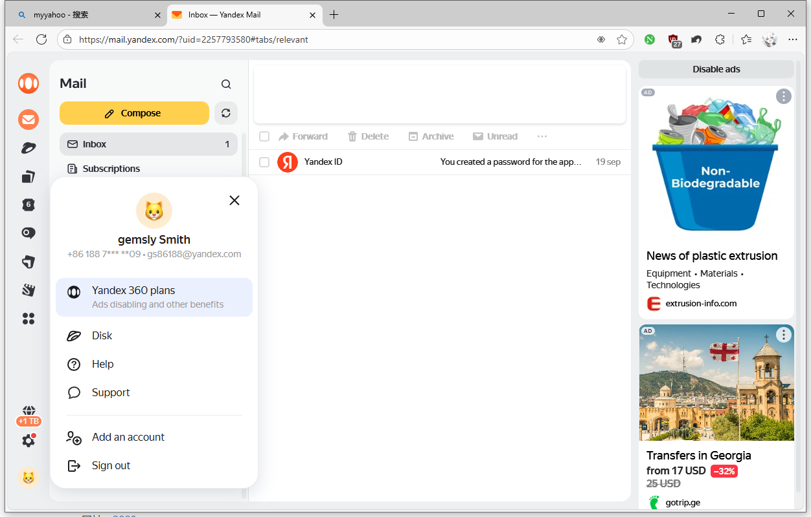

### 8. Tuta

- 服务商：Tuta

- 特点：同样也是一个加密的邮件和日历，服务提供商注册简单，能同时有多个账户共存。有6个后缀可选，部分收费，声称以无广告为卖点。

- 后缀：tuta.com/tutamail.com/tuta.io/tutanota.com/tutanota.de/keemail.me

- 网址：[https://mail.tutanota.com](https://mail.tutanota.com)

  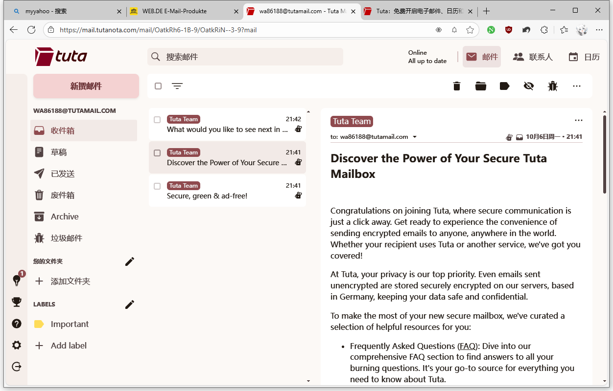

### 9. iCloud

- 服务商：Apple

- 特点：苹果用户专属，没有苹果设备访问难，量力而行。

- 后缀：icloud.com

- 网址：[https://www.icloud.com.cn/mail](https://www.icloud.com.cn/mail)

  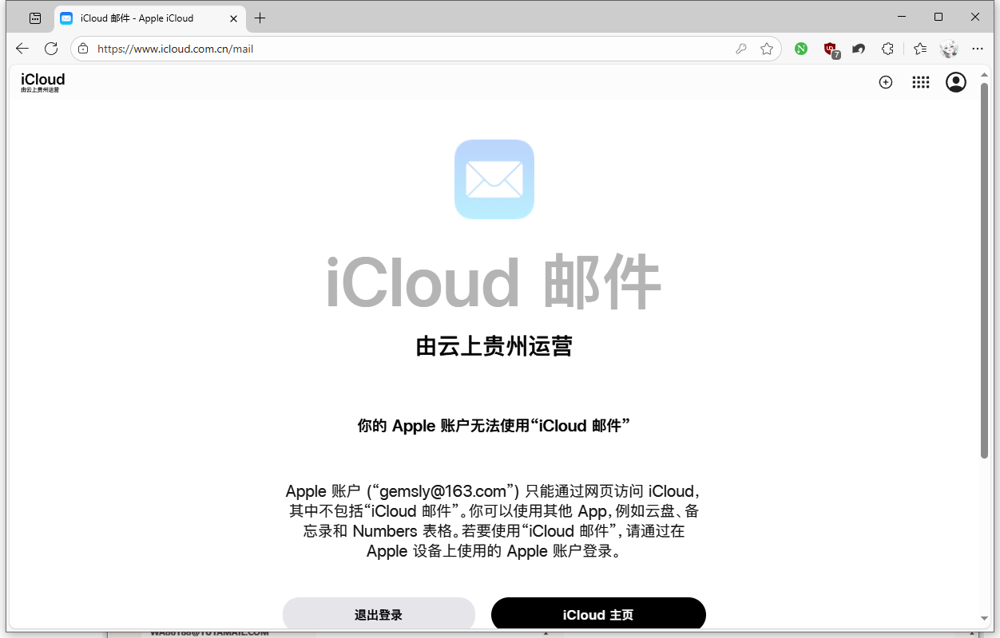

### 10. Mail.ru

- 服务商：vk

- 特点：一个来自俄罗斯的邮件服务提供商，国内访问速度特别慢，可以用86号码注册。

- 后缀：mail.ru/inbox.ru/bk.ru/list.ru/internet.ru

- 网址：[https://e.mail.ru](https://e.mail.ru)

  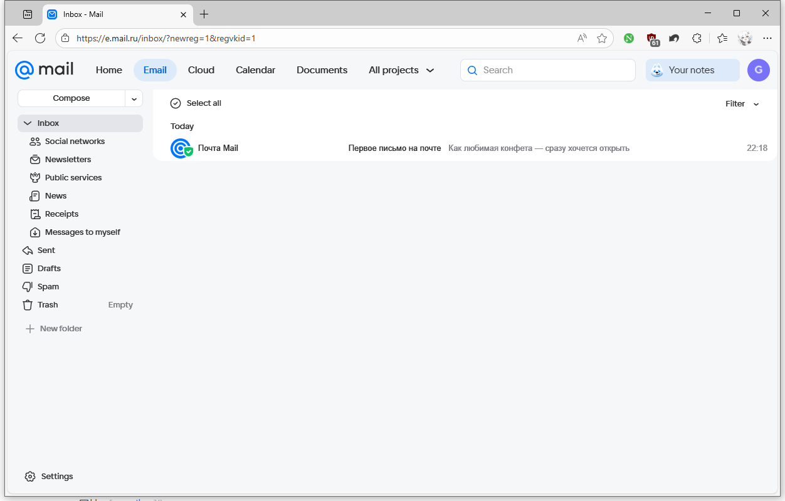

## 总结

以上就是个人使用过的国内外邮件服务提供商的实际体验与优缺点解析。这些邮箱各有侧重：国内邮箱依托本土生态，在本地化服务、易用性和访问便捷性上更具优势，适合日常通讯、国内平台注册等场景；国外邮箱则在隐私加密、国际通用性上表现突出，不过部分需要特殊网络环境支持。

当然，邮箱的 “好用” 与否因人而异，上述体验仅为个人感受，可结合自身场景试用后再做选择；或者参考上期文章搭建自定义一级域名的邮箱。