+++
published = 2025-10-31
draft = false
title = '注册免费 ggff.net 域名并使用 Cloudflare 托管'
description = '从 L53 账号注册（附地址生成器工具）、填写信息（海外邮箱 + 免责声明复制粘贴），到用「newuser」优惠券免费用域名，再到 Cloudflare 托管配置 NS 服务器，全程带清晰截图，无门槛、无复杂操作，新手也能跟着一步步搞定。'
cover = '/post/ggff-net-domain/cover.jpg' 
category = '技术研究'
tags = ['域名','建站']

+++

# 注册 ggff.net 域名 Cloudflare 托管教程

## 注册L53账号
我们打开L53官方网站[L53 - Third Level Domain - Cheap Domain](https://l53.net/)，点击右上角的“Client Area”进入客户区域，然后点击个人信息板块下的注册按钮。

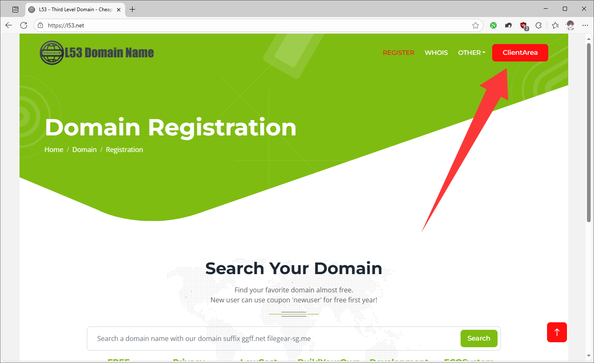
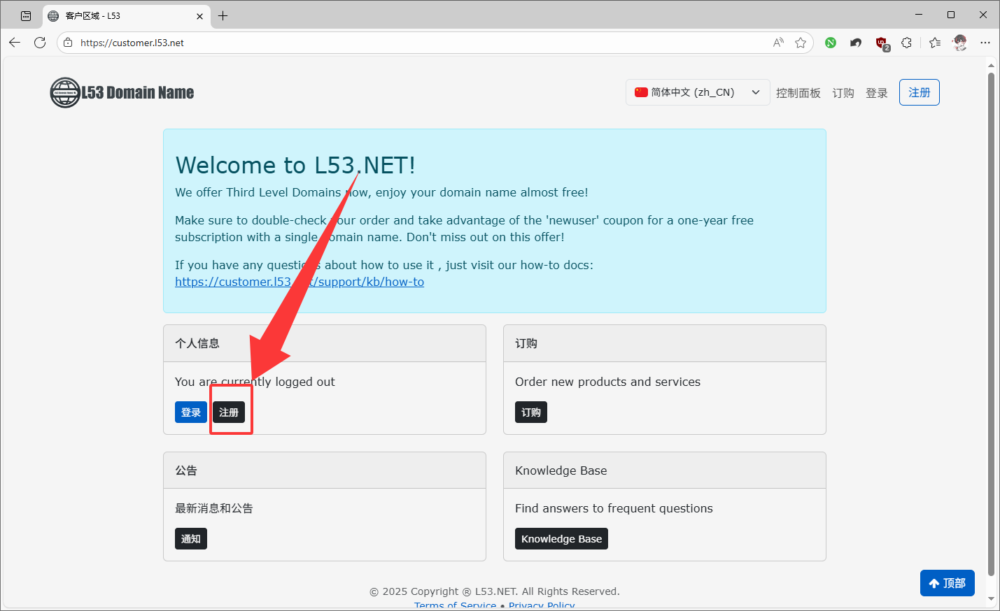

注册时的名字、姓氏可以用地址生成器填写，我用的是[https://www.meiguodizhi.com/](https://www.meiguodizhi.com/)。电子邮箱最好填自己的，比如Gmail、Outlook等海外邮箱，剩下的地址、信息、电话号码都可以用地址生成器的。问你是不是学生，填“No”；“Please fill in the form below”就是让你接受他们的免责声明，把`I understand that my information will be scrutinized and any violation of the Terms of Service will lead to the termination of the service.`复制粘贴进去就行。问“Where did you hear about us？”可以随便写，比如YouTube或者搜索结果“Searching”都可以。

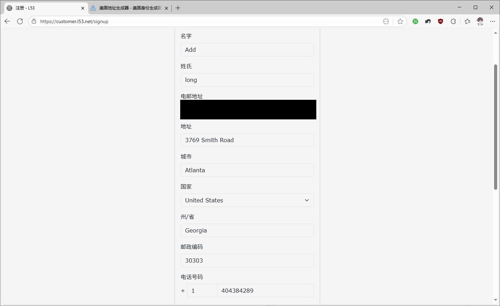
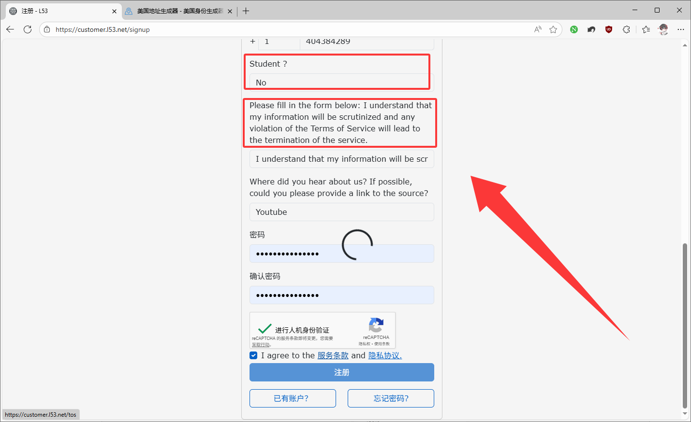

完成人机验证，点击同意服务条款和隐私协议，然后点注册，之后会往你的邮箱发一封验证邮件。点一下邮件里的“Verify email address”超链接，验证完成后登录自己的账号。

> 注意
>
> 点击超链接之后，会直接跳转到客户区域，不会提示信息。其实此时已经验证完成，直接点击个人信息中的蓝色登录按钮即可。

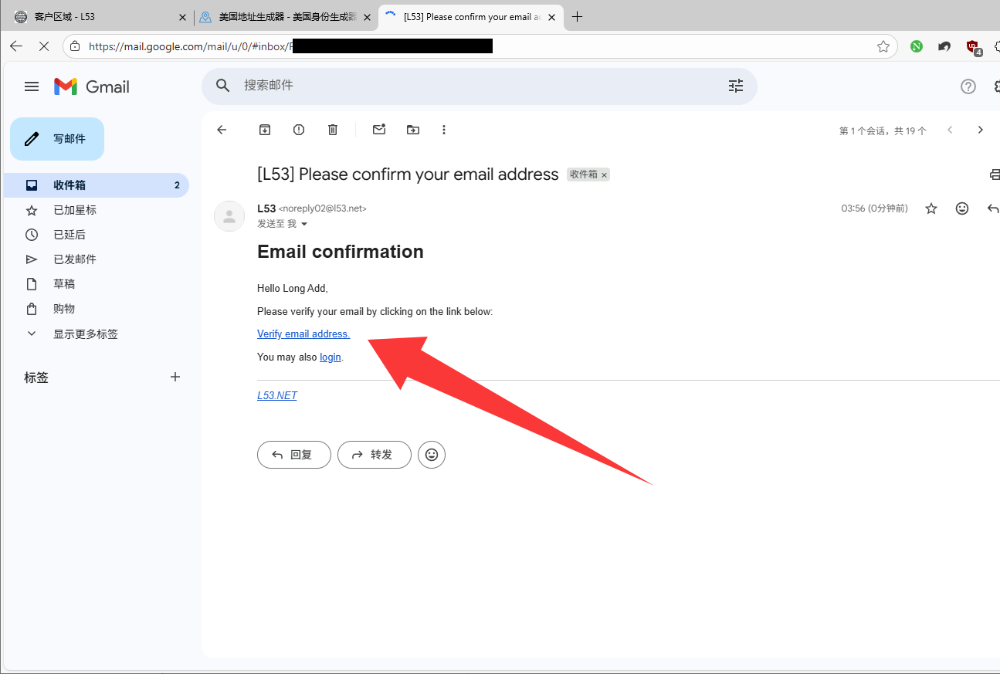
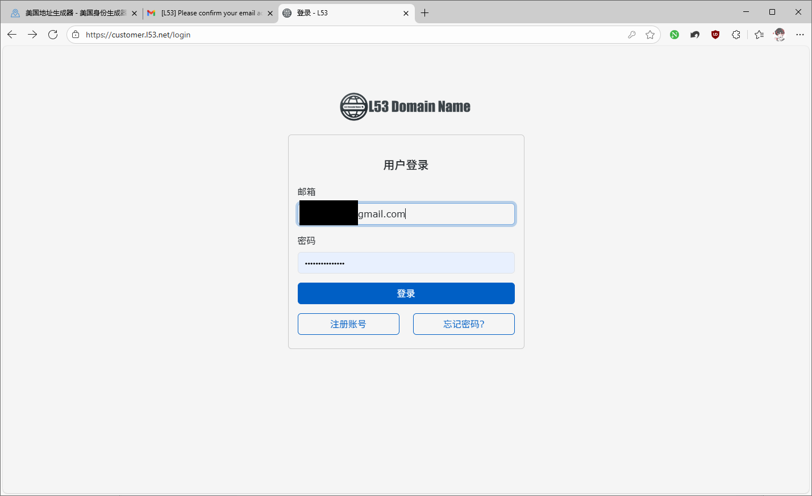

## 注册新域名
回到客户区域后，点击左侧导航栏的“订购”选项，再点击“选择产品”下的“域名注册和转让”。

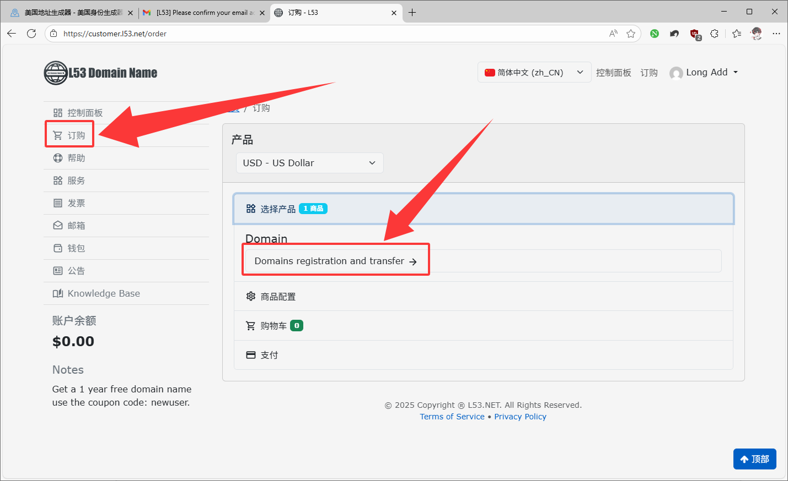

注册新域名选项里，有“filegear-sg.me”和“ggff.net”两个，一般选短的那个，好输入，两个都是可以使用 Cloudflare 的。输入自己想要的域名前缀，点下一步。

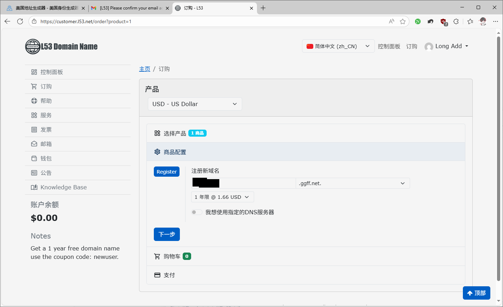

到了结账页面，这一步很关键，点一下蓝色的“有优惠券代码？”，输入“newuser”。应用后可能会弹出提示框，点确定就行，总计显示零元就对了，然后点击去结算。

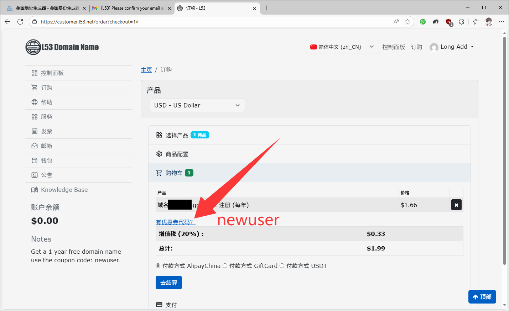
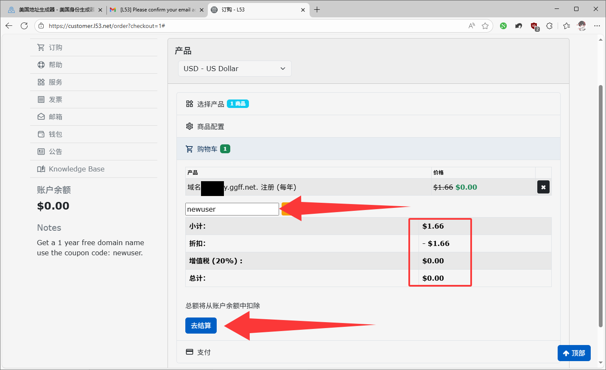

需要等几分钟让订单处理，处理完后订单状态会变成“已启用”，接下来我们要把它托管到Cloudflare。

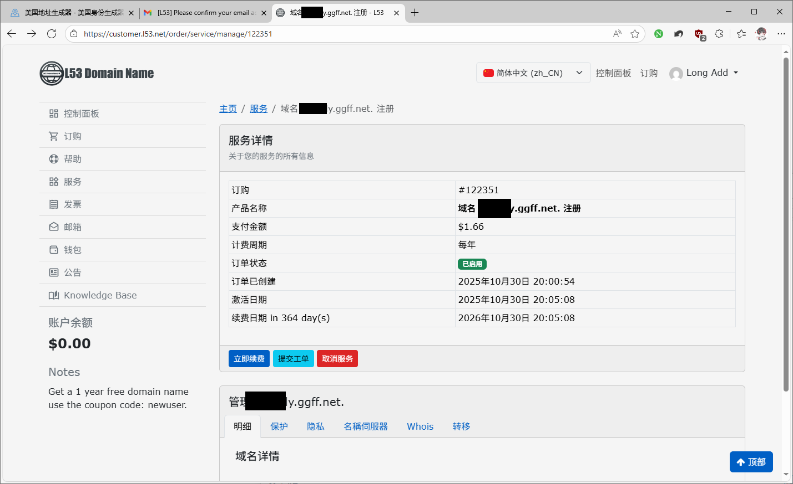

## 将域名托管到Cloudflare
把域名添加到Cloudflare，复制Cloudflare分配的两个NS服务器。

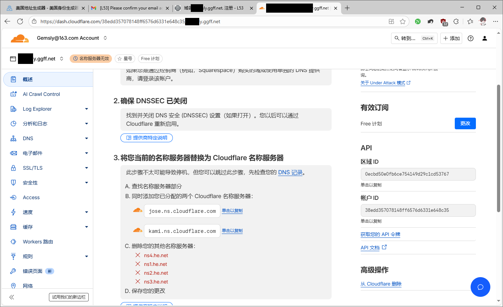

回到订单页，点击下面的“名称服务器”，把原来的4个NS服务器都删掉，替换成Cloudflare分配的NS，最后点击更新。过几分钟或几个小时后，域名在Cloudflare下激活，就配置完成了。

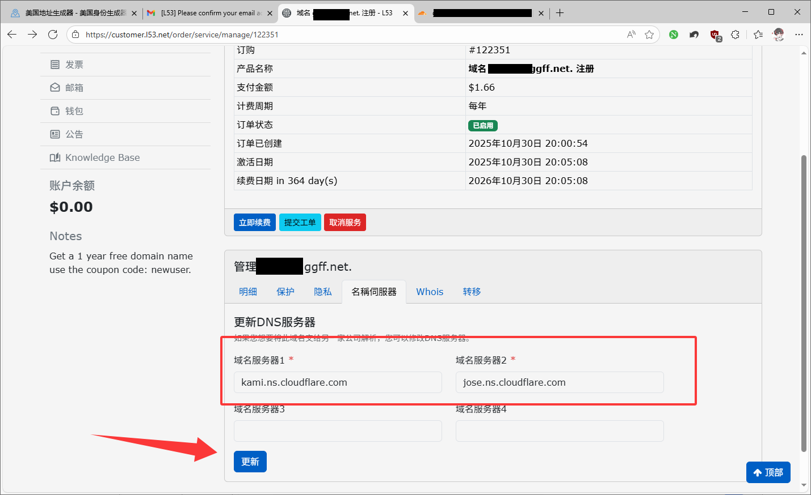
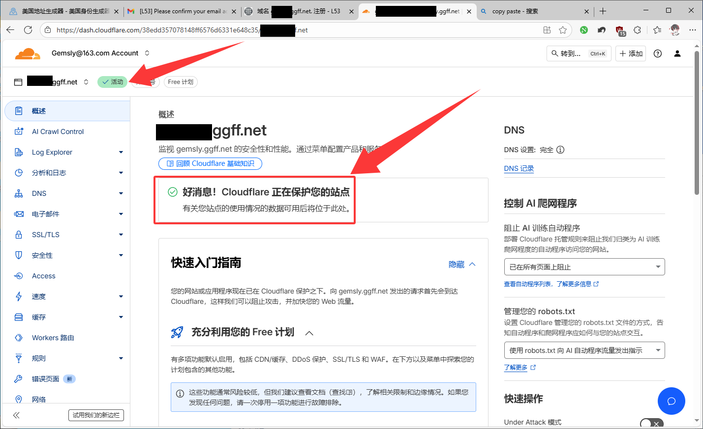

## 结尾
总的来说，整个流程其实就三步：先去L53官网注册账号，填信息时名字、地址啥的用生成器搞定，邮箱记得用海外的，免责声明复制粘贴那句英文就行；然后选“ggff.net”注册域名，结账时输“newuser”优惠券就能免费拿下；最后把域名加到Cloudflare，复制它给的NS服务器，回L53替换掉原来的4个，等激活就完事了。

记住这几个关键点，搞定后就能用这个域名搭网站、建隧道，挺简单的。