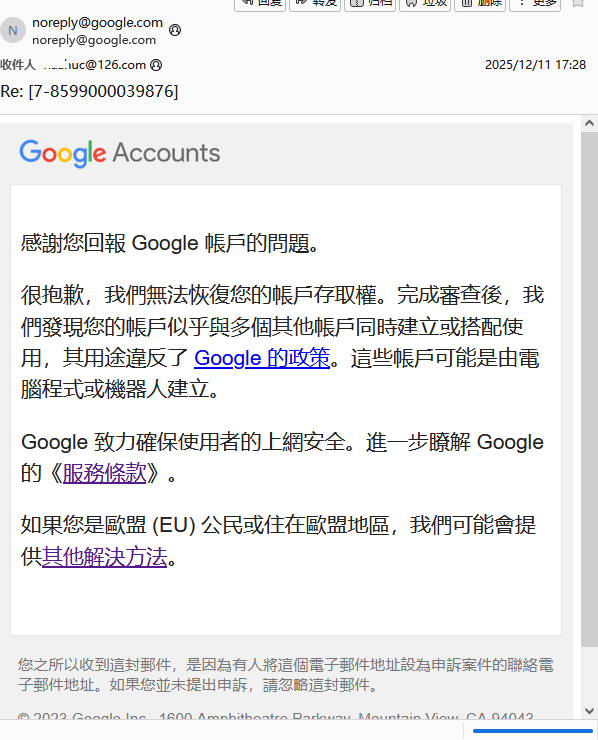
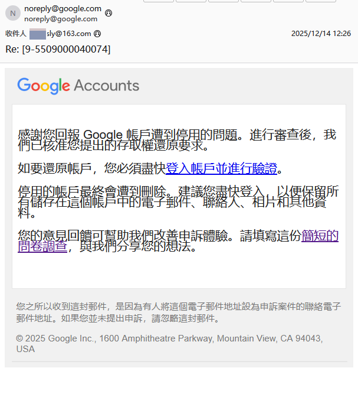

# Google账号被封禁了？申诉理由怎么填写？

个人经历

“敬请处理账号事项”，别小看这个谷歌又踢号了，当我看到谷歌在手机设备上踢号的时候，我就觉得事情不简单。过完验证一看，果然被停用了。

这两个 Gmail 账号，提供一个是用来监测网站数据的 Search Console 绑定的是主号，现在根本无法登录查看核心数据；想重置几个常用平台的密码，发现验证邮箱全是这两个被封的账号，相当于密码重置通道直接被堵死的。

## 为什么会被封？

说穿了就是国内网络环境和谷歌风控逻辑的“水土不服”。

首先是国内普遍的 NAT 网络模式。我住的小区是典型的共享出口 IP，一栋楼几十户人家共用一个公网 IP，这种在国内稀松平常的网络配置，在谷歌眼里却成了“高危操作”。又有一种可能用的是共享机房 IP，后来才知道，这类共享节点的 IP 被万人骑，直接被划入了谷歌的“风险 IP 黑名单”。

## 申诉过程

第一次申诉，简单写了句“I am not a robot”或者其他的简单理由。提交后，谷歌回信大概率会拒绝，理由大概率也是此账号是和其他账号一起注册并搭配使用，违反了政策。

后来我去找了别人申诉成功的经历，甚至有很多很有意思的模板，把提示词发送给任意一个 AI 助手用于生成申诉小作文：

1. 实话实说版

   提示词：接下来写一个模板，谷歌账号解封相关，实话实说：由于本人在China IP地址时常会变动，没有想要违反相关规定。

   > 我的谷歌账号（请填写您的邮箱地址）近期被封禁，原因可能是我在**中国境内使用网络时出口IP地址频繁变动**。这并非我有意违反相关规定，而是由于本地网络环境导致的正常现象（例如切换Wi-Fi、移动数据或不同网络服务提供商）。
   >
   > 我始终遵守谷歌的服务条款，账号仅用于个人正当用途。恳请您理解实际情况，重新审核并解除对我账号的限制。

2. 谎言版

   提示词：写一封关于自身有心理疾病的谷歌账号申诉模板，要求在模板里说明这个Gmail账号绑定了医院用来接收诊断报告，要求解除封禁。

   > 我的Gmail账号近期被系统封禁，我理解并尊重谷歌为保障账号安全所采取的措施。然而，该账号对我当前的医疗健康管理和新医院的诊疗衔接至关重要，恳请贵团队在了解实际情况后予以特殊考虑，尽快解除封禁。
   >
   > 我本人长期受心理疾病困扰，目前正接受专业精神科医生的系统性治疗。此Gmail邮箱已与我当前就诊的医院正式绑定，用于接收所有诊断报告、治疗方案及医疗通知，是我获取关键健康信息的唯一指定渠道。近期，我因病情需要转至新医院继续治疗，该医院的主治医生明确要求调取我过往的完整医疗邮件记录，以全面查看诊断报告、治疗进展和用药历史，从而制定科学、连贯的后续治疗计划。
   >
   > 由于账号被封禁，我无法访问这些邮件内容，导致新医院的诊疗工作陷入停滞。医疗连续性对心理疾病患者尤为关键，延误可能直接影响我的康复进程和心理健康稳定。我确认该账号始终由我本人独立使用，无任何违规操作，封禁极可能是因系统误判登录行为所致，但所有操作均源于正常医疗需求。

其实谷歌的审核也没有那么严，但是最好不要直接复制粘贴我生成出来的文案，还是建议拿提示词去智能助手软件那里生成，我大号甚至写个“我的Gmail绑定了很多其他账号”就解除了，我用了方法一去申诉小号，全部都成功了。

## 建议

避免使用共享 VPN 节点，减少 IP 被多人共用的情况，降低被谷歌标记为“风险 IP”的概率，国际邮箱也可以用 Outlook 作为平替，可以直连，而且账号注册的限制没有这么多，不太容易被封号。

并且根据我个人使用的经验，只需要过一次申诉，后续只需要保持行为正常保持几个月到几年，触发封号的阈值也会越来越高，Google 对你的账号也会更宽容。短时间乱跳 IP 可能并不会触发封号，但还是建议把节点锁在一个国家或地区并保持行为正常，这就可以了。