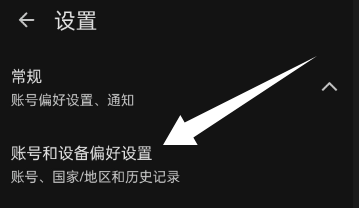
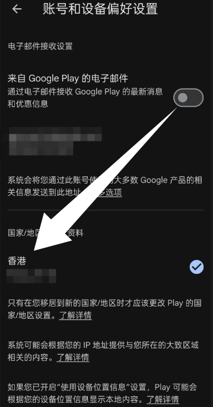
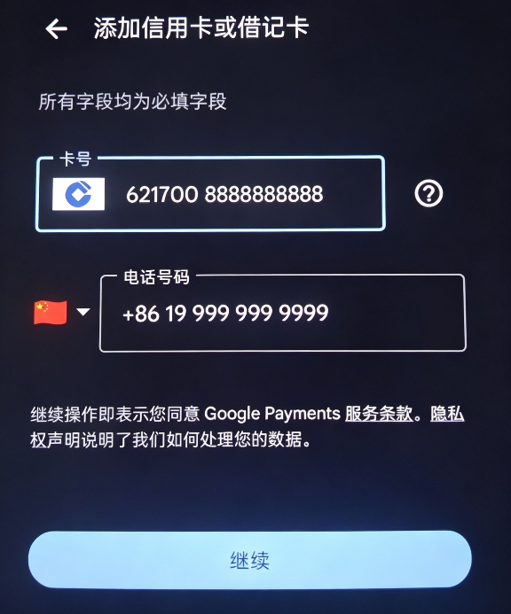
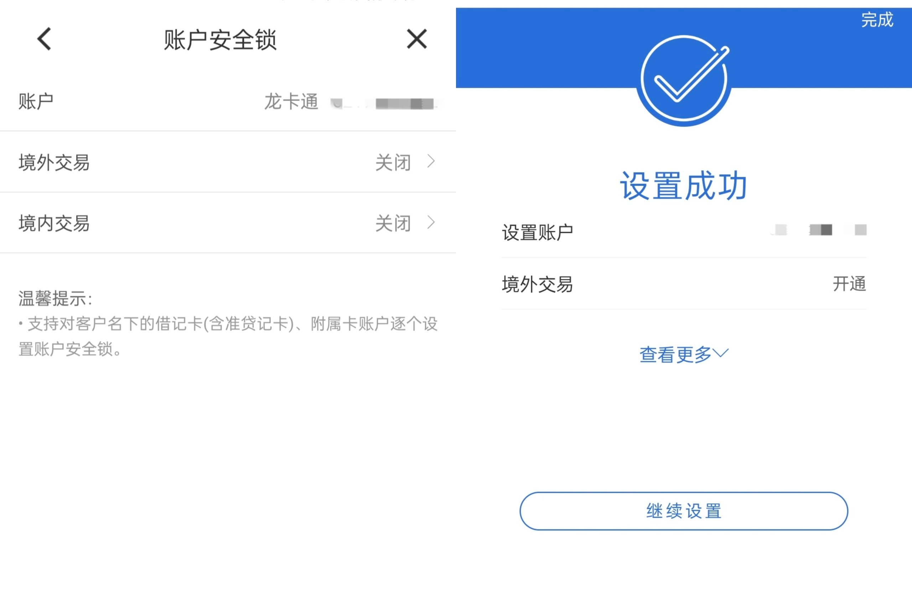
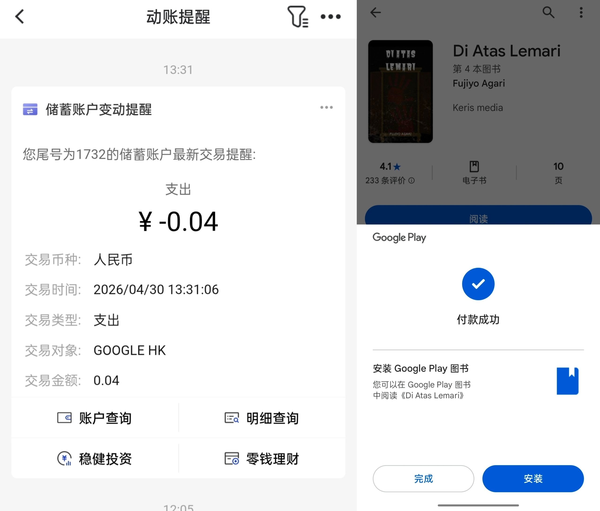
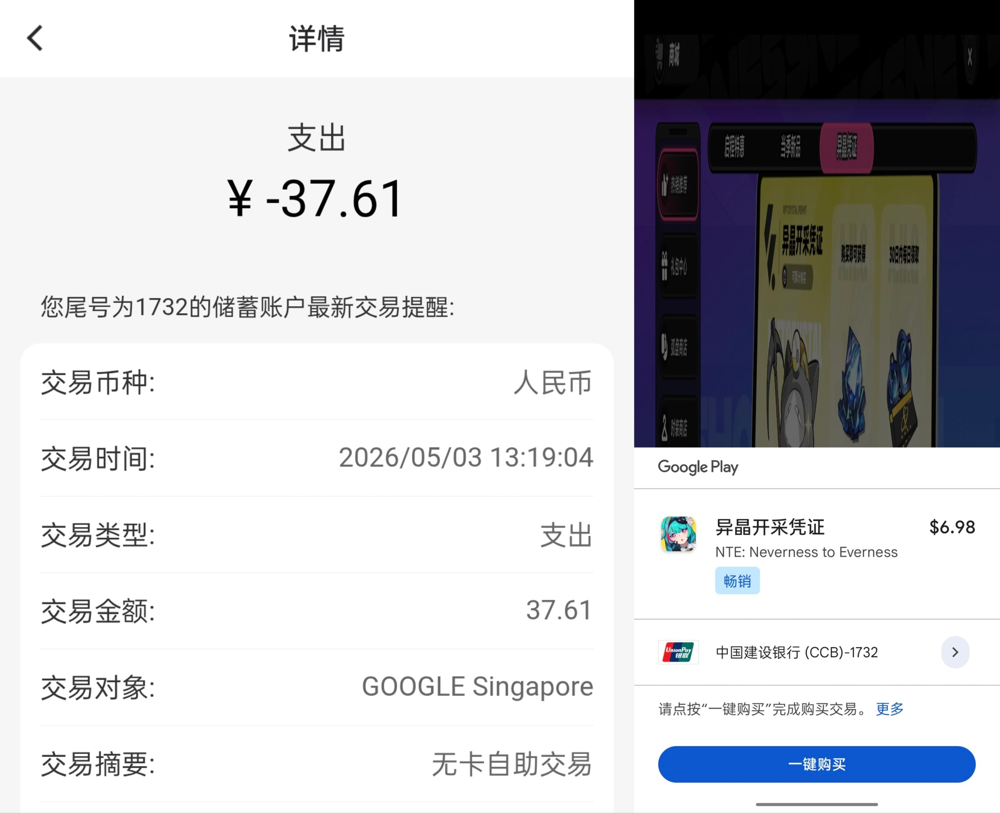
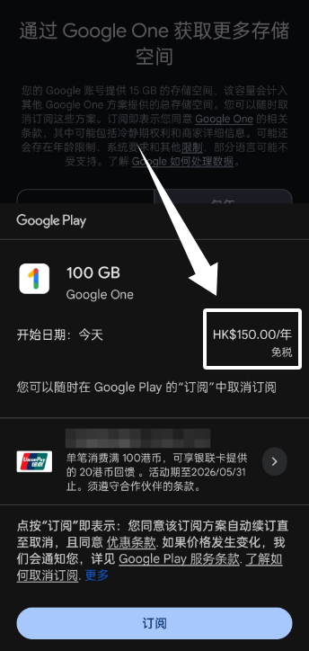
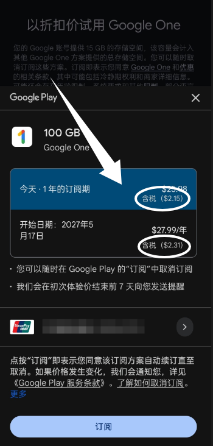

## 一、办理银行卡 / 银行帐户

近些年因为反诈风控的原因，对于银行卡和手机卡的管控日渐加强。首先你要准备的材料大概有：身份证、户口本、一个本人实名的手机号码（如果没有可以去线下营业厅办，不用自己实名的也可以，但是会比较麻烦）。

接下来银行开户大概需要的材料是：出生证明（可选，用于银行开户，但是有总比没有好）。如果你已有银行卡或者银行帐户，可以直接跳转到对应的环节。

## 二、本人实名的电话号码

可以去线下营业厅办理，但是有一个问题就是线下营业厅的套餐性价比都不怎么好，线上优惠的那种大流量卡针对未成年发卡的又很少。

如果只是用来收银行短信，可以假装妥协选其中最低价位的套餐，接下来打给 100 开头的运营商客服，说要改成 8 元保号套餐。如果不可以改，就可以投诉到：移动 10080、电信 10005、联通 10015。

号卡这一部分理应比较简单，如果遇到网点拒绝未成年办理，可以换一个营业厅甚至运营商，不需要害怕，因为您没做错什么事，这是法律赋予您的权利。

## 三、银行卡或银行帐户

本人实名的手机号码，最好等几天再去办理银行卡，因为手机号实名数据同步可能并没有那么快，到时候可能会遇到实名校验不通过的尴尬场景。

在路上预先填好对应银行的开户预填单，可以节省很多时间。我去咨询过，听说对未成年比较友好的招商银行，工作人员表示不能用微信支付宝，只能 ATM 和柜台存取款；如果要使用快捷支付，需要提供材料（工作 / 劳动证明、校方邮件等等）。

这还仅仅是银联卡，估计外币卡（Visa、万事达、美国运通）的风控和需要提供的材料只会更多，比如出国留学相关证明，估计柜员没有那么好骗。

但也有所见非所得的情况，比如自己个人年满 16 岁之后，发现建行快捷支付自己开了，可以自主签约第三方支付平台，包括微信支付宝，但柜员还是一股脑子说不能用。最后发现不仅能用，还能海淘和境外线上刷卡，真的是啪啪打脸了。

## 四、注册 Google 帐号

现在白天无论是通过网页还是手机注册，几乎都会被短信或二维码验证拦住，分享我自己的注册方法：

1. **无痕浏览器注册**
使用浏览器打开无痕模式，并把浏览器语言（在设置中）改为英语（美国），然后使用干净节点填写注册信息，有大概率会弹出手机验证。但这种方法现在可能会提示 “号码不能用于验证” 或者 “已经用了太多次”，有时候还要扫描二维码。

**请注意**：不要使用接码平台，因为平台的号码大多循环利用且叠加虚拟运营商，风险值非常高，后续帐号可能无法找回。

2. **半夜手机端注册**
我是在凌晨 1 点的时候，在手机端注册成功的，没有弹出手机验证，直接进入确认您的帐号信息环节。但是半夜注册这个可用性我试了也在慢慢降低，而且新号风控值高，大概率要过申诉。

如果注册的时候弹出验证手机号码，不用想会失败且无限循环，立刻取消停止尝试，因为国内环境下基本没办法通过验证。

3. **购买现成帐号**
直接去买一个帐号，但是拿到手的帐号，要把安全邮箱设置成自己的，要确定卖家没有绑定过手机号，后续如果用手机号找回会很麻烦。

## 五、如何给 Play 商店储值

### 方法一：购买礼品卡

1. 先确认 Play 商店区域：点击 Play 商店头像，滚动到底部点击设置，展开常规选项，查看国家地区和个人资料选项，确定自己处于哪个区的 Play 商店。

   

   

2. 如果没有设置地区，Play 商店首页会按照登录 IP 确定，可以随意创建一个地区资料，**最好选香港或新加坡**，给以后绑定国内卡留通道。

3. 去国内购物平台，购买对应地区的礼品卡，购买完成后得到兑换代码。

4. 兑换：点击 Play 商店头像→付款和订阅→兑换代码，输入得到的兑换码即可。

**建议**：从支付开始全程开启录屏，后续出现纠纷举证更有依据。

**注意**：近年 Google 对匿名礼品卡开启清洗，无法确定礼品卡来源及资金是否合法；且如果充值 10 美元礼品卡，内购只用 8 美元，剩下 2 美元会变成死账。

### 方法二：绑定银联储蓄卡（港 / 新区可用）

大部分人注册 Google 账号会选美区，但美区**不能用银联**，有 VISA、万事达、美国运通可以忽略。

- 美区：账单地址可写免税州（如俄勒冈），地址可在 Google Map 随意找当地真实地址复制，姓名填拼音就行。

- **香港 / 新加坡区**：支持绑定国内 62 开头银联卡，适合未成年选择。

**绑卡流程**：
手机端直接绑定 62 开头银联卡，如果输入不了就改成“扫描卡”，填入卡号和银行预留手机号，点击下一步，银联国际会给预留手机号发送短信验证码，填入即可完成绑定。

**重要前提**：国内银行大多有账户安全锁，防止境外盗刷，可询问客服或 AI 助手关闭方法。建行卡关闭安全锁时，预授权了中国香港和新加坡的扣账，港区、新区 Play 商店都能成功扣款。

设置好之后，就可以尝试付款了。可以先买一本几分钱的图书试试支付通道是否通畅。如果一切顺利，就可以开始尝试以应用内购买的方式进行订阅或游玩了。

### 港区 vs 新区

- 香港区：税率更低，部分 AI 服务无法订阅，游戏有港澳台特供版。

  

- 新加坡区：AI 服务解锁较好，应用和游戏多为全球版，目前征收约 9% GST 消费税，同款商品价格比港区高。

  

**建议**：两个区的 Google Play 商店都留着，按需使用。当然，一个银行卡可以分别添加到多个 Google 账号。

## 六、个人遇到的问题

- **跨区储值闪退问题**：

  部分游戏有港澳台特供版和全球版（如《异环》）。如果用**港区 Play 商店**给**全球版**储值会直接闪退。客服告知是因为港区有爱玩天地代理的港澳台特供版，而全球版由 N2E 直营，**跨区充值会被拒**。

  - **解决方法**：必须使用**对应发行区域**的 Play 商店账号进行充值，不要跨区操作。

- **多账号同时登录的扣款优先级**：

  如果手机同时登录了多个 Google 账号（如一港区、一新区），应用内购时默认会**按照先登录（主账号）的 Google 账号来付款**。

  - **典型冲突**：若先登录的是港区账号，将**无法订阅 ChatGPT 等港区锁区应用**。
  - **解决方法**：此时必须**先退出港区账号**，只留下新加坡区账号，才能成功付款。如果付款完成之后，又把港区的账号添加回去了，那么该账号依旧具有付款时的高优先级。
  - **账户绑定技巧**：**一个银行卡可以绑定多个 Google 账号**，只需在对应银行 APP 的“安全锁”功能里，同时**预授权中国香港和新加坡**的扣款即可。

- **双机/多账号共存方案**：

  如果你拥有两台或以上的手机，可以通过**调整登录顺序**让两区丝滑共存：

  - **主力机**：先登录港区 Google 再登录新加坡区 Google。
  - **备用机**：先登录新加坡区 Google 再登录港区 Google。

> **关于虚拟机的安全提示**：
>
> 虽然类似 VMOS Pro 等安卓虚拟机可以用来代替备用机进行订阅活动，但虚拟机的系统环境具有**高度非正常用户特征**，极易被 Google 或应用识别并**触发账号风控**。为了账号安全，**建议使用真机操作**。