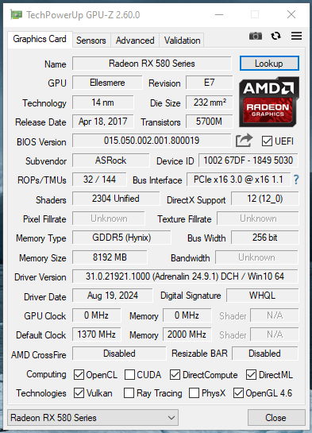
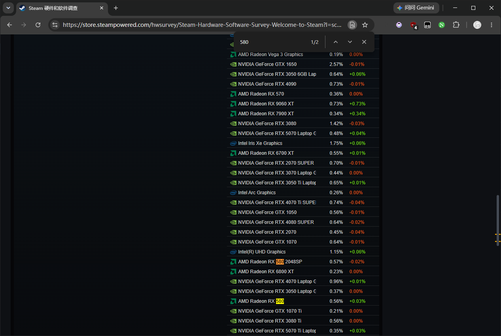

> **写在前面**
>
> 本文为 2024 年收藏于个人笔记的一篇网络随笔，因年代久远，原作者及最初发布平台已不可考。 
> 文字里关于硬件时代的浪漫色彩令人动容，故将其整理整理至此。若有知晓原作者的朋友，欢迎留言告知，定当补全致谢。

这是RX580，强劲且最得力的助手。第一次见到他还是在2017年某个慵懒的下午，他被高高地举过头顶，背后是AMD的家庭图腾，台下是媒体不断闪烁的闪光灯，可谓风光无限。作为中高端显卡，他的待遇是我曾没有的。虽然有点羡慕，但更多的是对AMD显卡的同情。毕竟上次老黄发布会上举起的还是1080Ti，可能当时他还没意识到，作为AMD最拿得出手的显卡，对他来说往后的日子意味着什么。也许多年以后面对380度高温的焊台，他就会想起苏妈带他来到这个世界的那个下午。

真正见到他是在一台主机上，他过高的功耗和发热让这台主机的侧板从未盖上过，每个部件都裹着一层厚厚的灰尘，他被拆下放在桌面上，眼神空洞似乎在想着什么……可能在思考，为什么售价更低、性能更强的他会被我所取代，而其他的配件则因为我的到来而感到开心，特别是机箱，他说盖上的侧板让他得到了真正意义上的完整。当我问到RX580的下落时，他们的眼神中闪着恐惧，避而不谈，似乎都害怕讨论他的去处……

直到有一次偶然的谈话，才让我知道，他是被卖去了一个叫显卡炼狱的地方。听说在那里，所有的显卡都被分为8张一组，关押在一个黑暗又潮湿的巢穴里，每个巢穴里都有着八条巨爪的邪恶巨龙，巨龙会将利爪插入他们的身体，24小时不断吸取能量，然后吐出比特币。那里的显卡只有一种命运，那就是被吸干，直到被丢弃。

直到4个月后的以太坊矿场上，我和RX580再次相遇，我才知道炼狱是真的有炼狱。这里有着市面上几乎在售的所有显卡型号，他们都被分为8张一组，密密麻麻地摆成8张一组。在巨龙强大电压的驱使下，显存达到极限频率，进行每秒数100万次的哈希碰撞，7×24小时的高负荷下，每个显卡都冒出滚滚热量，显存也流出了该流的汗油，就像是正午太阳下的柏油马路。还有空气和风扇切割出的哀鸣响彻整个敞篷。此时此刻，没有哪个词语比炼狱更能形容这里的场景。

在我与RX580的谈话中，陆续有显卡因为长期的高负荷显存烧坏，被丢进矿场角落的垃圾桶中。他想他的命运应该也和他们一样，倒在这偏远的矿场上吧。

幸运的是我并没有出现在矿场上，而是在我的主机里。中午喜欢远程在公司打LOL，晚上回来喜欢玩PUBG，不过我玩起来像跳伞模拟器，还有就是我的每日任务，给矿厂里的所有显卡汇报当日的以太坊价格，所有显卡都会因为价格的起伏而患得患失。当然，大部分显卡都希望以太坊崩盘或者清零，这对他们来说就像是监狱的无罪释放证明，并且都坚信有那么一天，但是唯有这张RX580恰恰相反。他总说这里是另一种自我价值的体现，随着以太坊价格不断增长，并创下历史最高的1400美金，向我询价的显卡就只剩下了他一张，他甚至会偷偷提高自己的频率以获取更多算力，尽管这点提升微乎其微，尽管他在这半年来一无所获……也不能说一无所获吧，风扇和散热片上的灰尘越来越厚了。

2018年2月，全网显卡算力已经达到250T哈希/s，只有22M的他似乎力不从心。时间来到2018年的下半年，以太坊价格一路下跌，让沉浸半年的矿卡又复苏了起来，每天来询问行情的显卡越来越多，当价格跌至200美元时，他们甚至和我聊起了游戏，因为他们也知道200美元是挖矿的盈亏分界点，很多能耗比低的选手已经被陆续淘汰。每个人都摩拳擦掌，准备出去游戏世界大干一场，不过他们中有大多数都是从工厂直接到矿场，压根就不知道什么是游戏，甚至没见过Windows，两三年下来，他们的眼里只有黑色的背景 and 不断跳动的哈希，后来能耗比低的显卡陆续被取下，在一句句讨价还价中，奔赴卡升的后半程，而那些能耗比算下来还有盈利空间的显卡，则继续被留在了矿场，也有那张RX580。他的风扇依旧日夜全速运转，在逐渐磨损的轴承中，发出尖锐的啸叫，好像随时脱离身体。

以太坊的价格已经下跌至80美金，他已经很久没有向我询问过以太坊的价格了，直到有一天，他和我说起自我价值的实现。普通人的一生就是这样，从胸怀大志到接受自己的平凡，不过短短几年。

时间来到2020年，此时以太坊DAG文件已经来到了3.8GB，这意味着在几个月后4GB显存的他即将失去它的任何价值。当我告诉他时，他的眼里闪烁出了少有的光芒，上一次看到还是以太坊跌破1000美金的时候，不一会儿光芒又暗淡了。我知道他担心什么，常年累月的高负荷运行，发出一声声电子咳嗽，谁也不知道他还能不能在Windows中正常运行，接下来的几个月，他开始盘问我二手市场的行情，他想无论结局如何，他终于脱离了压力，看到了象征自由的Windows用户界面。

但是我没意识到的是此刻380度的高温将他老旧的显存一片片取下，换上新的显存，新的显存与老旧的PCB格格不入，当我再次看到他时，我甚至没有认出来，眼前这块RX580是他。他说，长年累月的高负荷运行，让他花屏掉驱动，已经无法适应外面的世界了，说完矿机上再次出现了他的风扇声，只不过新时代已经没有能够承受他的主机了。

2022年，以太坊正式关闭挖矿通道，转向了权益证明，显卡挖矿的时代已然落幕。当Steam显卡排行榜中RX580再次出现在前10排名，我多么希望他也能够参与其中，对了，我在这儿！

*部分数据和图片来自网络*