+++
published = 2025-11-10
draft = false
title = '不到 5 元 / 年！.xyz 纯数字域名注册'
description = '6-9 位纯数字.xyz 域名属 1.111B Class，Spaceship 渠道年价约 4.77 元，首年与续费同价。非主流程后缀、适用场景，详解注册流程及托管到 Cloudflare 的技巧，性价比高适合个人使用。'
category = '技术研究'
tags = ['建站','域名']
+++

# 注册局的福利？XYZ域名1.111B特价域名注册
今天来跟大家说说域名——这可是我们科技生活里超重要的东西，我就经常用到域名。之前我已经给大家介绍过如何获得免费域名，但网上能注册到的免费域名，基本上都是三级域名。比如DigitalPlat这家机构，注册了dpdns.org这个域名后，就生成了无数个不同前缀，供大家免费使用，可这种三级域名你只有使用权，没有所有权。
今天我就来跟大家分享，如何用极低的价格，买到一个完全由自己掌控的独立域名，每年成本不到5块钱人民币，堪称史上最便宜的域名！接下来会跟大家说清它为啥这么便宜、有没有坑、有哪些缺点、怎么快速找到好记的靓号，还会简单演示完整的注册和使用流程~

## 一、概述
### 1. 注册局的市场策略
这个低价福利来自.xyz域名注册局的市场策略，他们在公布的白皮书里明确写到：将6位到9位数字的.xyz域名，划为“1.111B Class”类别。1.111B就是1.111 Billion，也就是11.11亿的意思，简单说就是从000000.xyz到999999999.xyz，这11.11亿个纯数字形式的域名，是特殊价格。

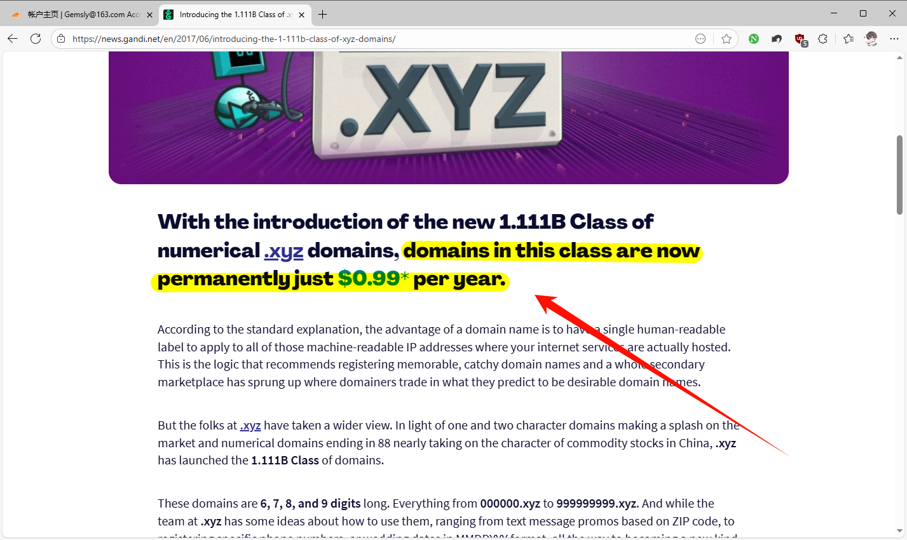

这个优惠不是只首年低价，而是后续续费、转移域名，都能保持这个价格，指导零售价是每年0.99美元。长期以来大家都倾向于用英文字母做域名，很少用纯数字，注册局就是想通过这个优惠，激活这类海量域名的库存。

### 2. 常见注册渠道的价格
我们在各大域名注册商那里，基本都能注册到这类域名，而且大多遵循.xyz注册局的指导价0.99美元。比如Namesilo，还有国内的阿里云，阿里云上大概7块钱一年，差不多就是0.99美元的汇率价。

不过我今天要给大家介绍的注册途径，比指导价还便宜，只需要0.67美元，折合人民币不到5块钱，非常离谱。

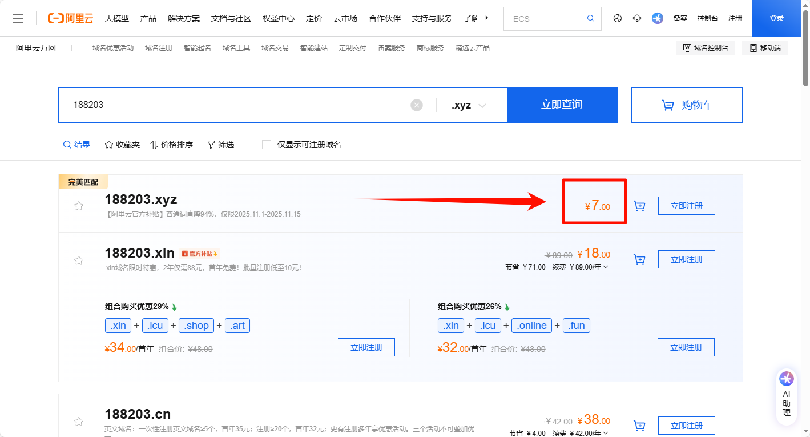

### 3. 赔本赚吆喝
XYZ注册局给到的批发价是每年0.65美元，而且所有通用域名，都得向ICANN，也就是互联网名称与数字地址分配机构，每个域名每年支付0.2美元的固定管理费。这么算下来，这个域名的成本总共就得0.85美元了，还没算交易手续费，所以卖0.67美元基本就是赔本赚吆喝，纯粹是烧钱获客的产品~

这个低价渠道就是Spaceship，它是一家正规的域名注册商，还是大家可能听过的廉价域名提供商Namecheap的子公司。Namecheap光看名字就知道主打廉价域名，而它的子公司Spaceship，比它还要更Cheap，完全是把“低价”做到底了。

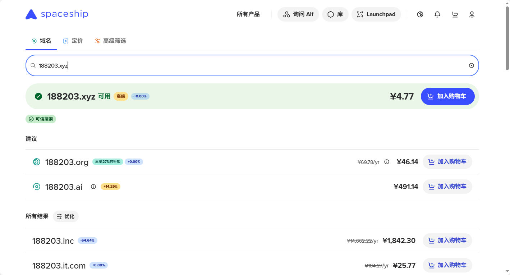

## 二、域名的优缺点&适用场景
### 1. 优点：掌控权在手，使用无差别
这类低价域名跟其他域名使用起来几乎没区别，掌控权完全在你自己手里，不用受制于第三方，而且首年和续费价格一致，长期使用不会突然涨价，成本特别可控。

### 2. 缺点：纯数字+非主流程后缀
唯一的缺点就是它必须是纯数字形式，这多少会让人觉得不够专业；另外.xyz后缀也不是特别主流，还有很多网友把它戏称为“小姨子”后缀，这两点大家可以提前了解下。

### 3. 推荐适用场景
综合来看，我更建议大家把这类域名用于个人用途，比如绑定家里的NAS、自己的服务器，或者搭配Cloudflare相关的服务，像Workers、Pages之类的，用起来都很顺手。

## 三、注册教程
Spaceship虽然是国外的网站，但不用科学上网就能访问，而且支持中文界面，这也是友善的点之一。

### 1. 注册账号
首先打开Spaceship的网站，要是你的电脑是中文语言，它会提示可以切换为中文语言界面，直接点击切换就行，现在界面就变成中文了，看着更亲切。

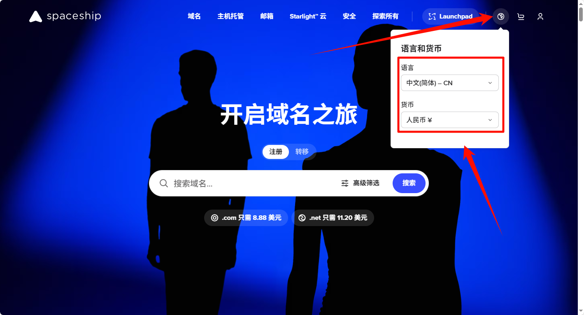

如果还没有账号，就先注册一个：点击右上角的按钮，再点下方的“注册”，填好相关信息后，点“下一步”就能完成注册，流程很简单，不用额外准备什么材料。

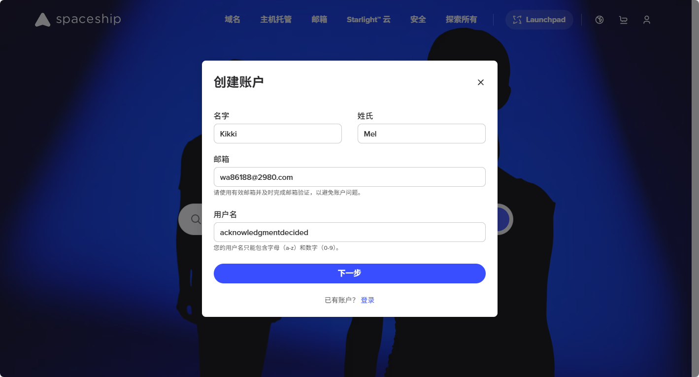

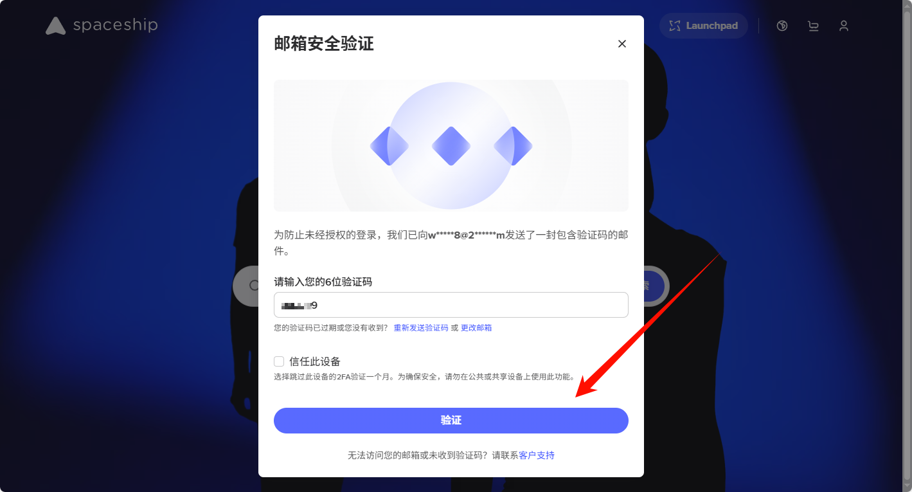

### 2. 搜索域名
注册好并登录后，点击左上角的logo回到主页，在搜索框里输入想要的域名——格式必须是6-9位数字+xyz，比如随便写一个六位数123456.xyz，然后点击搜索。

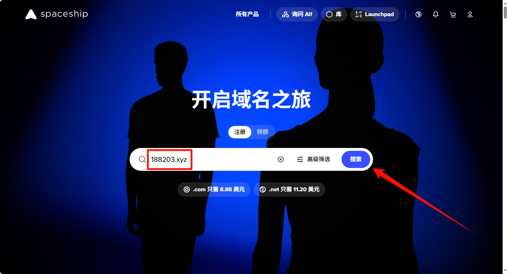

搜索结果出来后，就能看到价格是4.77人民币一年，因为我们切换了中文界面，所以以人民币计价，英文界面显示的就是0.67美元。对比一下下面其他后缀的域名，都比.xyz贵很多，动辄几十块一年，甚至有的要几千块，咱们这个6-9位数字+xyz的域名，不管是首年还是续费，都保持这个低价，特别划算。

这里一定要注意：数字必须是6位到9位之间！如果改成5位数，再查价格就会发现，首年就要13.25元，而且续费价格直接涨到89.17元，瞬间就不划算了。有时候域名搜索后会自动刷新不出来，点击一下地址栏按回车重新刷新就行，大家可以自己试试对比下价格。

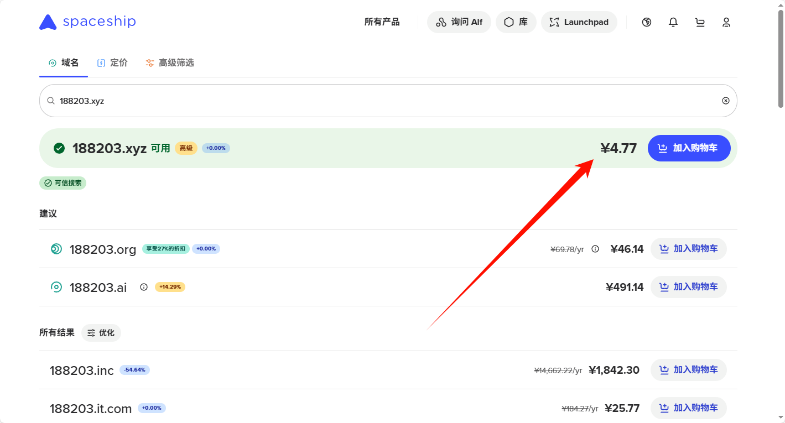

### 3. 快速筛选靓号
要是想找自己心仪的、好记的数字组合，一个个手动搜太费时间，推荐用west.cn这个网站，能批量查询域名是否可注册。

打开west.cn后，根据自己的喜好设置查询规则就行。比如传统的188，后面再接上其他三个数字，然后在下方的规则里做选择；接着在域名列表里去掉.com，只勾选.xyz后缀，避免无关结果干扰。

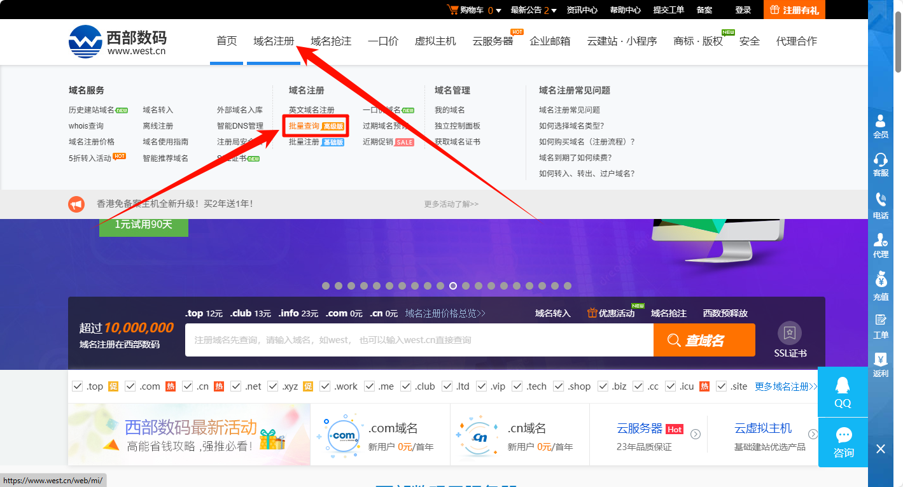

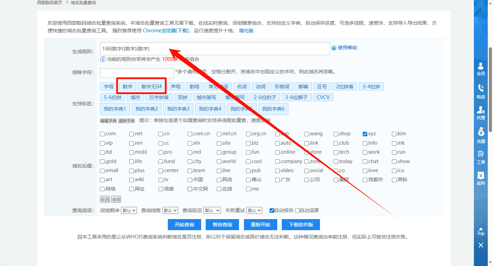

这个网站还特别贴心，照顾到有些中国人不喜欢数字4，在规则里可以设置排除4，特别人性化。点击“开始查询”后，网站就会一个个匹配域名状态，已经被注册的会显示在“不可注册域名”列表，我们不用管，只关注“可注册域名”就行。

等一段时间后就会显示全部结果，我之前查的时候总共有1000条记录，在这些里面找，虽然像188666这种特别顺的组合大概率已经被注册了，但还是能发现不少好记的，比如188806、188909这些。我最后选了188806.xyz，复制下来回到Spaceship粘贴搜索，果然是可注册状态，价格还是4.77元。

不过要提醒大家，偶尔会出现数据库延迟的情况，west.cn显示可注册，但Spaceship上已经被别人注册了，这时候换一个就行，总体来说这种批量查询的方式能大大节约查找时间。

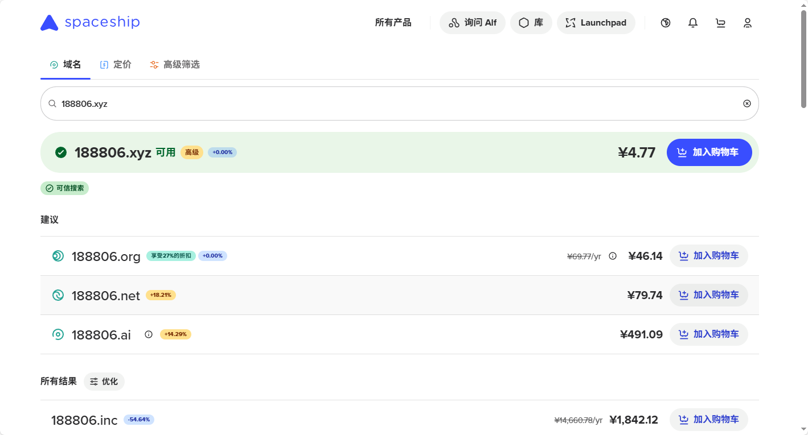

### 4. 加入购物车+跳过增值服务
选好域名后，点击“加入购物车”，再点击“查看购物车”，这时候会弹出网络托管、邮箱服务等增值服务，一般情况下我们都用不上，直接点击“继续”就行。

点击“结账”可以再确认下价格，确实是4.77元一年，而且自动续费默认是关闭状态，明年需要手动续费。这里还有“添加促销代码”的选项，我已经试过了，4.77元已经是最几乎已经是独立域名的底价了，基本没有优惠空间了。

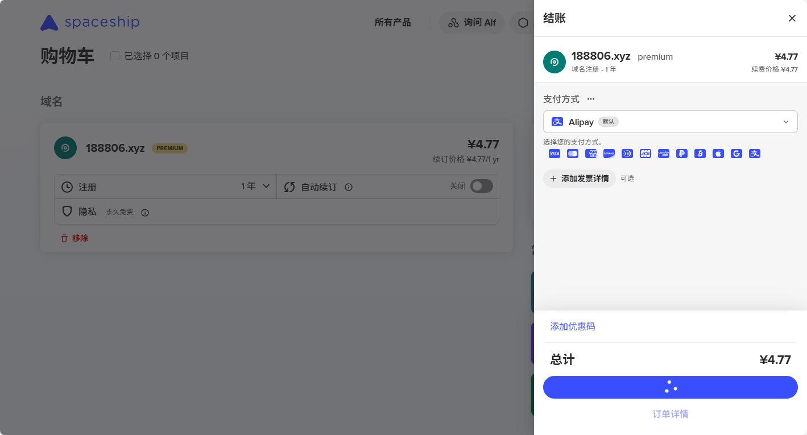

### 5. 填写联系人信息
点击“结账”后，会提示“请检查缺失的信息”，其实就是需要填写域名联系人信息。这里顺便说一句，Spaceship的隐私保护服务是永久免费的，所以大家可以填写自己的真实信息，除了平台之外，其他人看不到这些信息，很安全。

当然根据我的经验，随便填也没问题，它不会验证信息的真实性，我一般都是找个地址生成器随便填一下，填好后点击“保存”，再点击“应用”就可以了。

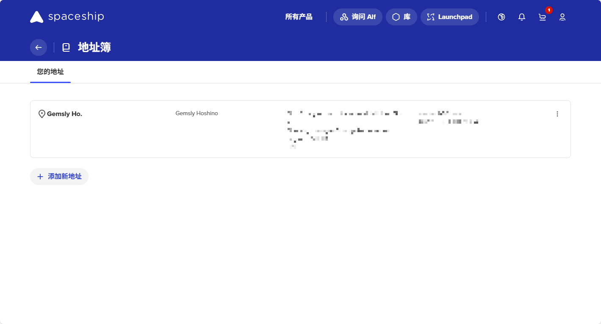

### 6. 支付完成：国内推荐支付宝
接下来就是正式支付了，点击“添加付款方式”，可以选择信用卡、借记卡、PayPal或者支付宝，我推荐国内的小伙伴选支付宝，操作最方便。

添加支付宝后，需要给这个支付方式定义一个名称，随便写就行；下面还要选择账单地址，直接选之前新建的联系人地址就可以，这个对支付没影响。保存好支付方式后，点击“立即付款”，输入支付宝的支付密码，点击“确认付款”，这样域名就注册成功啦！

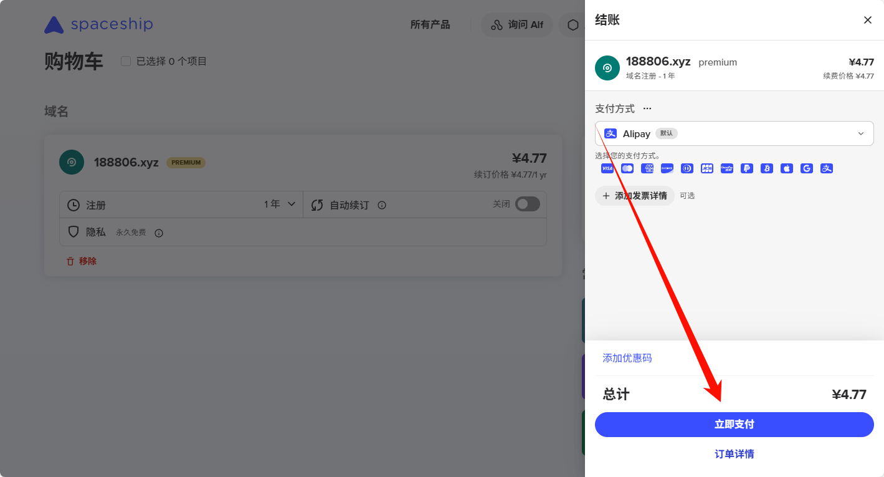

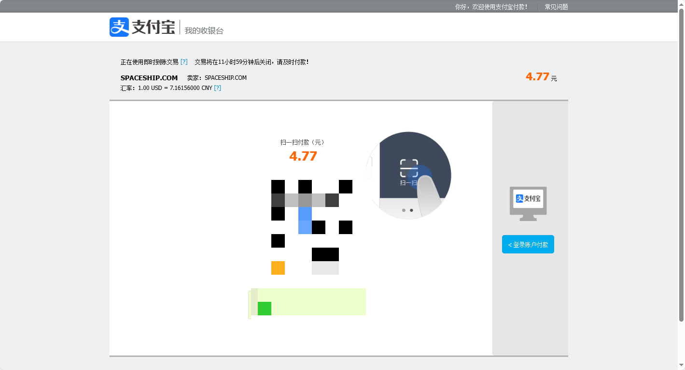

## 四、域名管理技巧
### 1. 域名续费

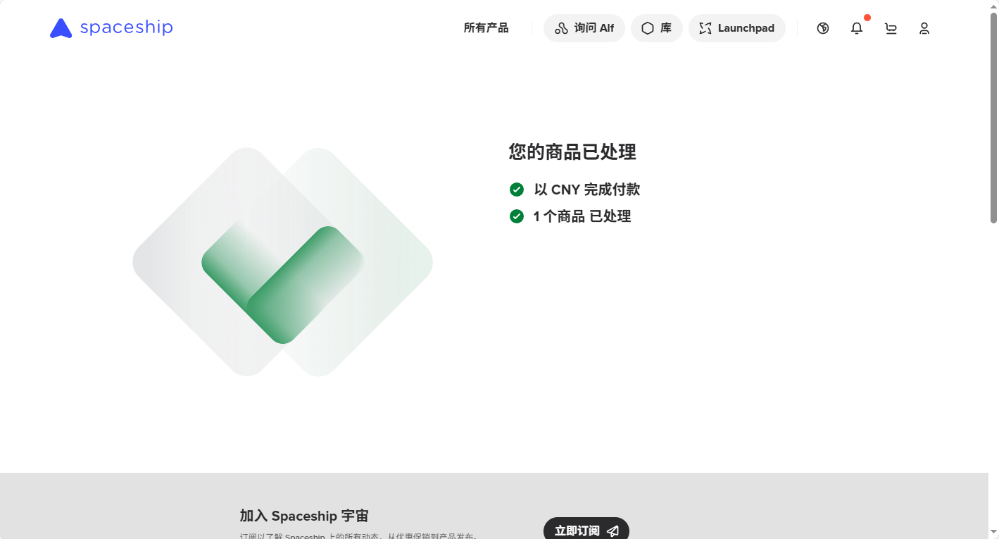

付款成功后，如果卡住，就直接回到上一个标签页，就发现付款成功了，要是想对域名进行管理，比如续费，就点击“所有产品”，再点击“域名”，然后选择“域名管理器”，在这里就能看到你购买的全部域名了。

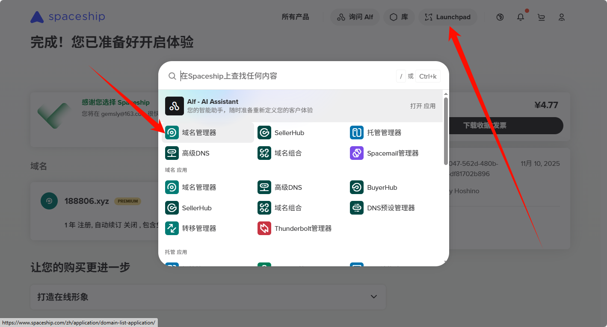

点击域名会弹出相关信息，想要续费的话就点击“延长订阅”，最长可以选择续费9年，9年总共42.94元，加上第一年的4.77元，一共差不多47块钱，不到50块就能搞定接下来10年的域名，可谓是相当划算了。

不过我目前没打算续费，因为这个优惠价格不确定以后会不会提价，建议大家先使用一段时间，确定没有问题再回来续订。而且我在网上看到有人说，个别地区的某些域名可能会被墙，虽然这种概率不高，但保险起见，还是先测试好访问情况，再考虑长期续订。

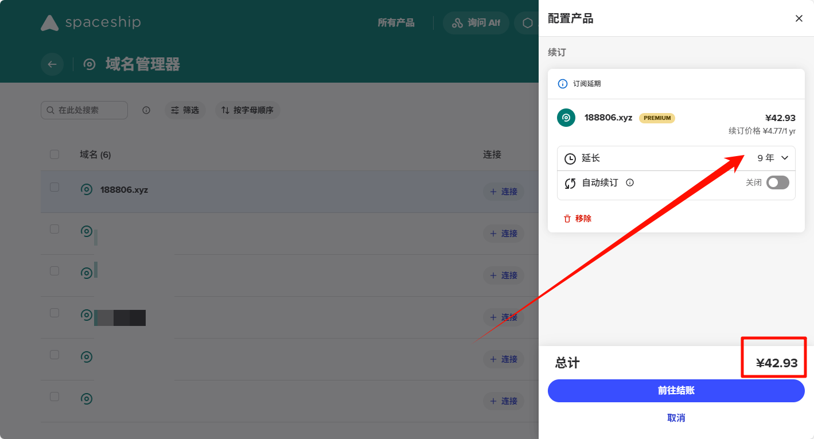

### 2. 默认设置&托管到Cloudflare
购买域名后，点击“名称服务器和DNS”，会发现它默认绑定的是Spaceship自家提供的两个名称服务器，点击“高级DNS”，就能在里面管理DNS记录，比如添加记录让域名指向自己的服务器或网站等。

但作为过来人，我更建议大家把域名都托管到Cloudflare上面管理，一方面方便使用Cloudflare提供的其他服务，另一方面Cloudflare的解析速度更快，免费的解析数量也更多，用起来更省心。

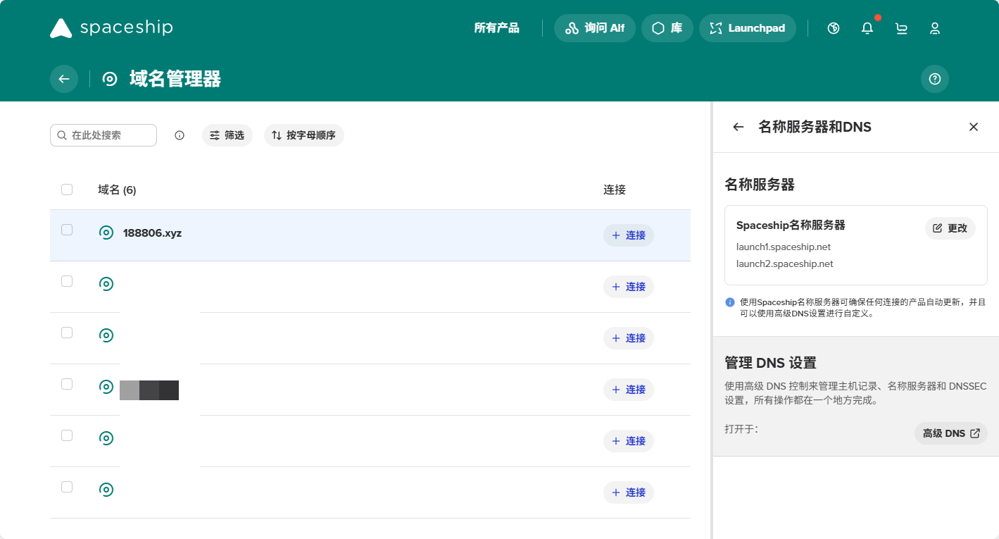

### 3. 托管到Cloudflare
托管方法很简单，下面快速给大家演示一下：首先在Spaceship的“名称服务器”页面点击“更改”，再选择“自定义名称服务器”；然后登录Cloudflare账号，没有的话可以免费注册一个，登录后点击“加入域”，输入刚注册的.xyz域名，点击“继续”。

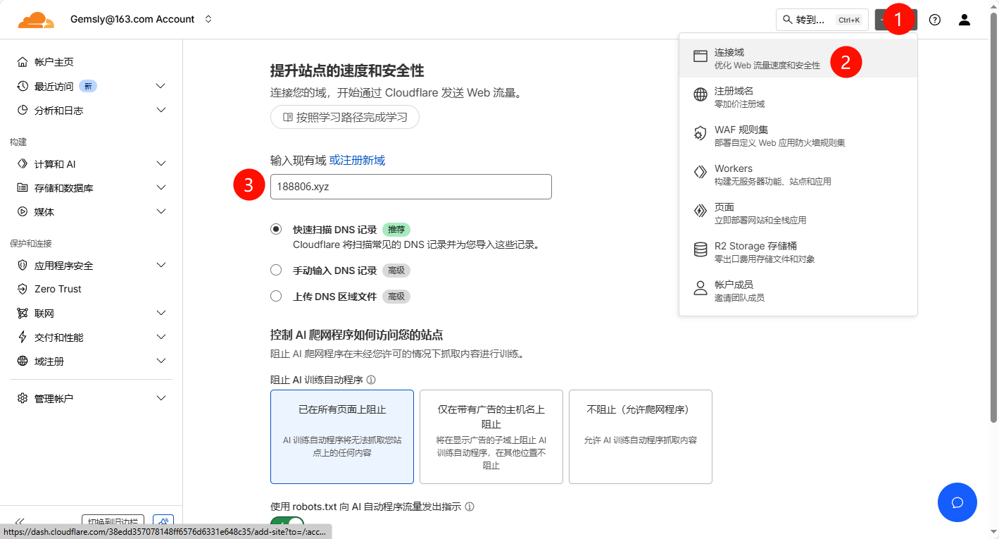

计划这里直接选免费版，接下来会看到Cloudflare分配的两个名称服务器，把它们复制下来，粘贴到Spaceship的自定义名称服务器里，然后保存DNS设置。

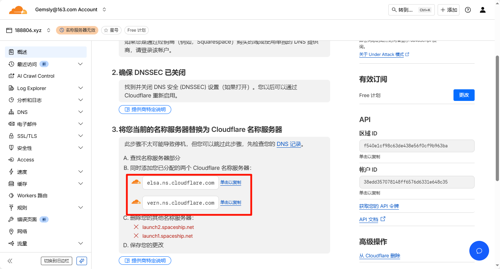

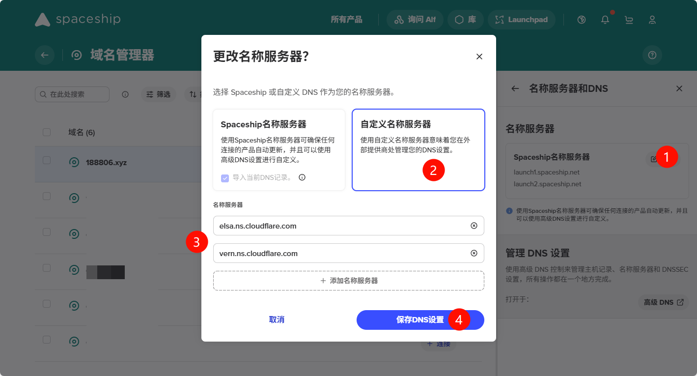

回到Cloudflare后，可以点击“立即检查名称服务器”，然后在首页查看状态，刚开始可能会显示“名称服务器无效”，需要等待一段时间，这个等待时间有长有短，我大概过了30分钟回来刷新，状态就变成“活动”了，说明域名已经成功托管到Cloudflare。

之后除非需要操作续费，否则就不用再登录Spaceship了，直接在Cloudflare上管理DNS记录就行，特别方便。

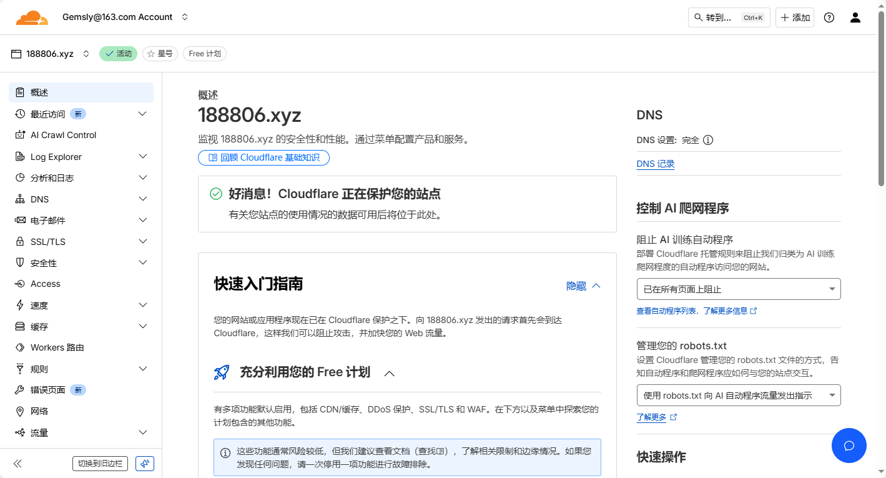

## 五、总结
总而言之，这个.xyz纯数字域名一年不到5块钱，四舍五入相当于免费了。对于有域名需求的小伙伴来说，与其使用不太稳定的免费三级域名，不如花点小钱买一个完全掌控的独立域名，性价比和稳定性都更有保障。无论是搭建隧道、建立网站、个人邮箱都是非常稳定的，并且几乎已经是独立域名的底价，学生党也能轻松买下一年使用权，算是非常实用的的了。
